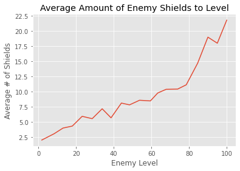
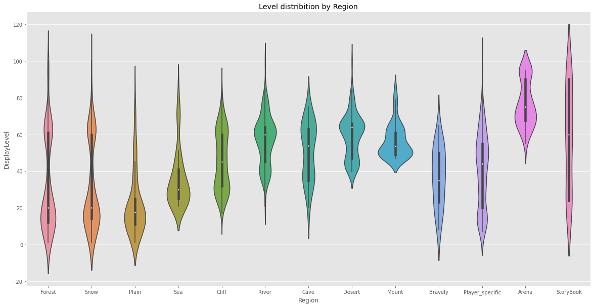
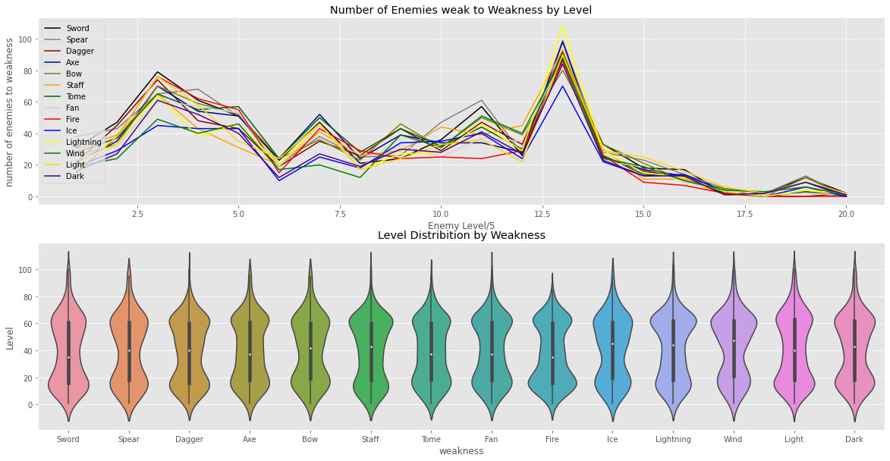
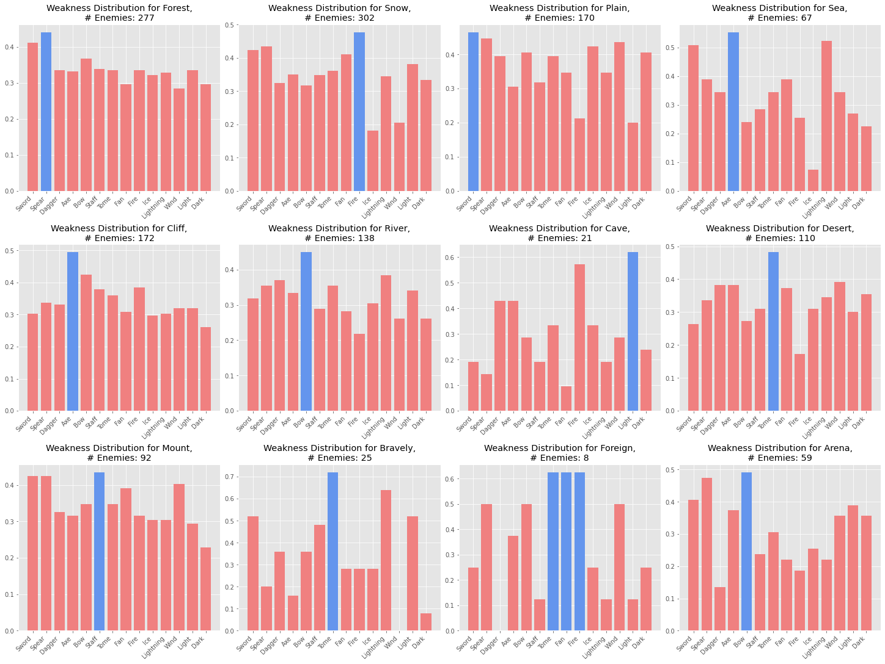
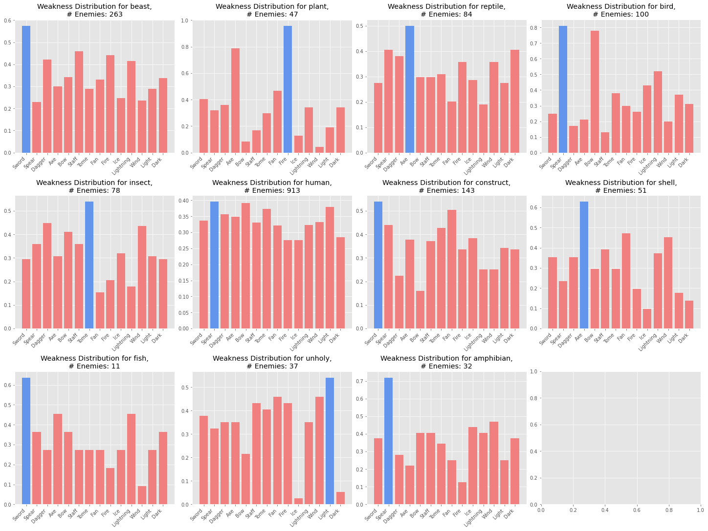
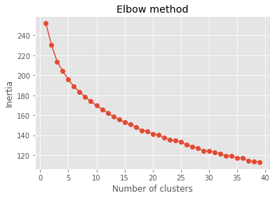
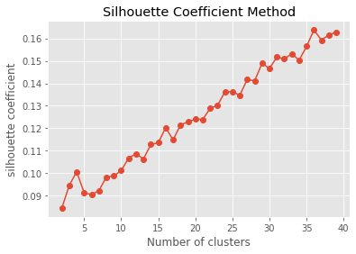
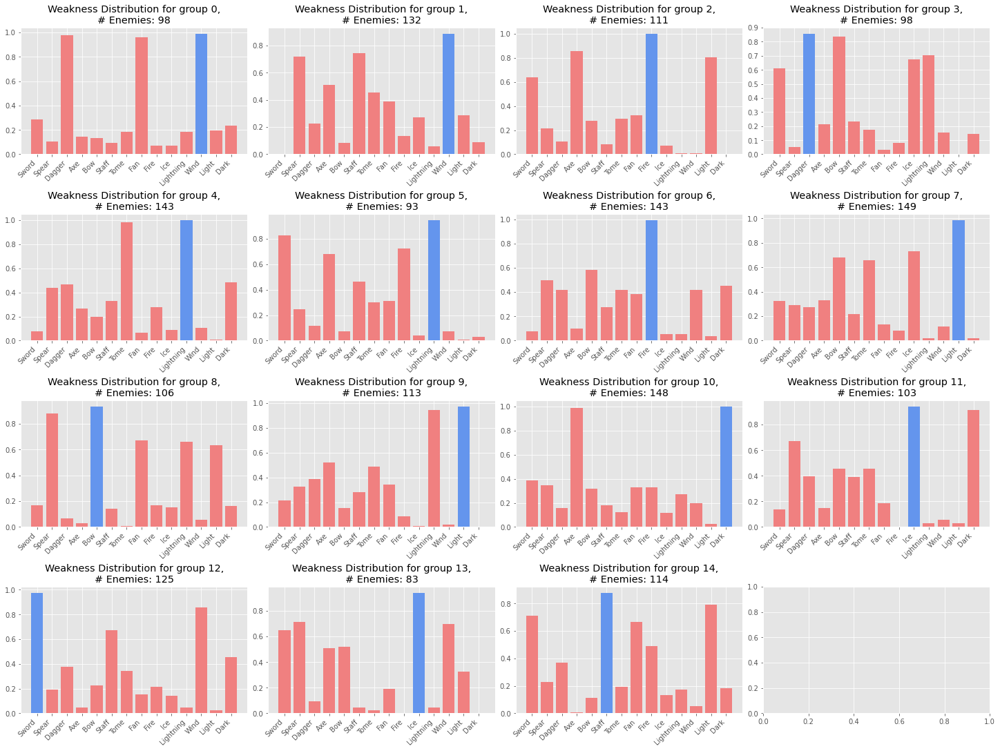
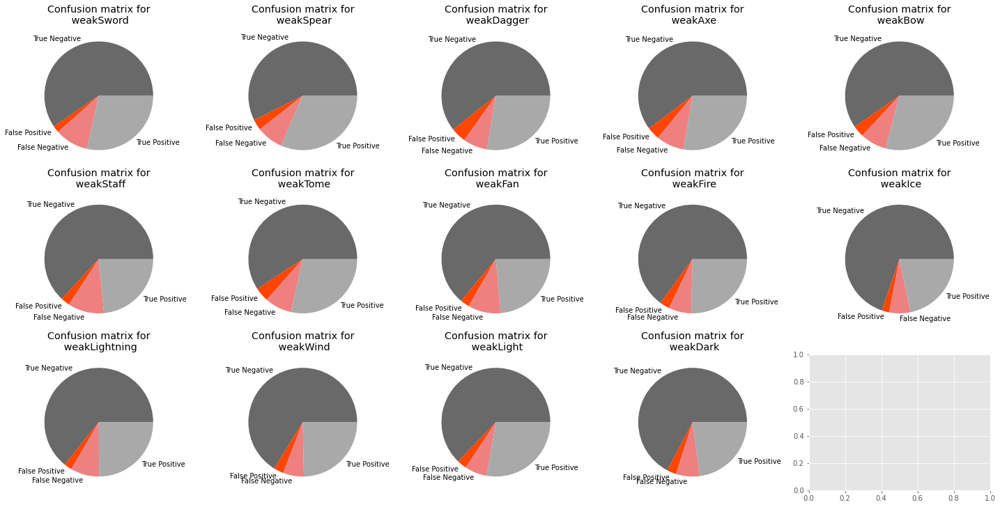
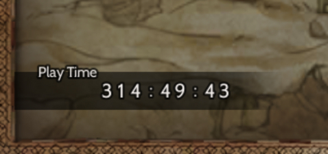

# Motivation

Octopath: Champions of the Continent (henceforth referred to as CotC) is a single player gatcha game where you control 8 characters of your choosing to fight tyrants, beasts, and arena champions. Basically, you are meant to save the world. Unfortunately (or fortunately depending on who you are), this game is challenging. A majority of the players struggle to clear content, primarily due to the method of balance enforced by Square Enix.

In brief: There are 8 weapon weaknesses an enemy can have, and 6 elemental weaknesses. Each character *traditionally* only carries one weapon, and *traditionally* only has access to one element. This is important because enemies take **2.5 times more damage when being hit by a weakness**. Additionally, enemies have a certain quantity of shields that will decrease if you hit their weakness (or use shield-penetrating attacks from theives). When the enemy's shield count is reduced to 0, they will take **double damage**.

This means, if you are using characters that target the enemy's weaknesses, you can do up to **5 times more damage** than if you are not.

Lastly, each and every difficult enemy in this game has a "low-health" phase, which begins when their HP is lower than a certain threshold. Once they reach this phase, their attacks will be significantly more lethal, and is the run-ender for most lost fights. This means, without the ability to quickly close off a fight, you are putting yourself at risk, which makes large amounts of damage all the more necessary.

With that in mind, I will be doing analysis on enemy weaknesses, with a particular focus on finding the optimal weapon for a character to carry.

With that said, I will be starting with

# Part 1: Data Gathering

Fortunately for me, I will not be manually entering thousands of enemies worth of data. It's completely impractical, and I cannot derive the enemies stats with manual methods.

Thankfully, a data miner by the name of BoltGSR was gracious enough to share their mined data to meowDB, a strategy website for video games. After asking for the spreadsheet from the owner of meowDB and BoltGSR, I have the sheet to all CotC enemies and their relevant data.

https://docs.google.com/spreadsheets/d/1NBLiaWwPrqtbD53-lIOZrqjI9xK9p0SQNzJKj2GrvsM/edit#gid=264844635


```python
import pandas as pd
import re
import matplotlib.pyplot as plt
import numpy as np
import warnings

warnings.filterwarnings("ignore")
pd.set_option('display.max_rows', 50)
pd.options.display.max_columns = None
plt.style.use('ggplot')
```

THIS SHEET IS RELEVANT UP TO DECEMBER 1ST, 2022. THERE WILL BE NEW ENTRIES ADDED AS TIME PROGRESSES, AND THE RESULTS OF ANALYSIS MAY HEAVILY DEVIATE DUE TO THIS.


```python
main_df = pd.read_csv("Octopath English Enemy Data - v1.4.0.csv")
main_df.head()
```


<div>
<style scoped>
    .dataframe tbody tr th:only-of-type {
        vertical-align: middle;
    }

    .dataframe tbody tr th {
        vertical-align: top;
    }

    .dataframe thead th {
        text-align: right;
    }
</style>
<table border="1" class="dataframe">
  <thead>
    <tr style="text-align: right;">
      <th></th>
      <th>Id</th>
      <th>Label</th>
      <th>Name</th>
      <th>DisplayLevel</th>
      <th>Shields</th>
      <th>StartingWeaknesses</th>
      <th>HP</th>
      <th>PAtk</th>
      <th>MAtk</th>
      <th>EquipAtk</th>
      <th>PDef</th>
      <th>MDef</th>
      <th>Speed</th>
      <th>Crit</th>
      <th>CritDef</th>
      <th>Exp</th>
      <th>Money</th>
    </tr>
  </thead>
  <tbody>
    <tr>
      <th>0</th>
      <td>0</td>
      <td>NONE</td>
      <td>NO DATA</td>
      <td>NaN</td>
      <td>1</td>
      <td>NaN</td>
      <td>1</td>
      <td>1</td>
      <td>1</td>
      <td>0</td>
      <td>1</td>
      <td>1</td>
      <td>1</td>
      <td>0</td>
      <td>0</td>
      <td>0</td>
      <td>0</td>
    </tr>
    <tr>
      <th>1</th>
      <td>1</td>
      <td>Forest_Enemy_01a_001</td>
      <td>Marmot</td>
      <td>1.0</td>
      <td>2</td>
      <td>Sword, Spear, Dagger, Staff, Fire, Light</td>
      <td>91</td>
      <td>99</td>
      <td>99</td>
      <td>10</td>
      <td>10</td>
      <td>7</td>
      <td>69</td>
      <td>56</td>
      <td>110</td>
      <td>4</td>
      <td>19</td>
    </tr>
    <tr>
      <th>2</th>
      <td>2</td>
      <td>Forest_Enemy_01a_002</td>
      <td>Shambling Weed</td>
      <td>1.0</td>
      <td>2</td>
      <td>Spear, Axe, Fan, Fire, Lightning, Dark</td>
      <td>82</td>
      <td>99</td>
      <td>99</td>
      <td>10</td>
      <td>11</td>
      <td>8</td>
      <td>68</td>
      <td>65</td>
      <td>110</td>
      <td>3</td>
      <td>19</td>
    </tr>
    <tr>
      <th>3</th>
      <td>3</td>
      <td>Forest_Enemy_01a_003</td>
      <td>Scaled Viper</td>
      <td>1.0</td>
      <td>2</td>
      <td>Sword, Dagger, Staff, Tome, Wind, Dark</td>
      <td>87</td>
      <td>104</td>
      <td>104</td>
      <td>10</td>
      <td>7</td>
      <td>4</td>
      <td>72</td>
      <td>53</td>
      <td>110</td>
      <td>3</td>
      <td>20</td>
    </tr>
    <tr>
      <th>4</th>
      <td>4</td>
      <td>Forest_Enemy_01a_004</td>
      <td>Howler</td>
      <td>1.0</td>
      <td>2</td>
      <td>Sword, Spear, Bow, Fan, Ice, Lightning</td>
      <td>96</td>
      <td>93</td>
      <td>93</td>
      <td>10</td>
      <td>12</td>
      <td>9</td>
      <td>65</td>
      <td>60</td>
      <td>110</td>
      <td>4</td>
      <td>19</td>
    </tr>
  </tbody>
</table>
</div>


# Part 2: Data Management

As you can see, there are several entries that seem out of place. I will be dropping all NaNs in DisplayLevel, all NaNs in StartingWeaknesses, and I will be formatting StartingWeakness to a list in order to help with future analysis. Additionally, there are rare enemies called 'caits' that only take 1 damage and have ridiculous stats, so I'll be removing them for the sake of analysis. Additionally, there are also 'WIP' enemies with japanese names with the intent of future globalization, which I will be removing.

There is also one tutorial enemy that has 999999 HP, as well as one with 1 HP, which I will be removing.


```python
df = main_df[pd.to_numeric(main_df['DisplayLevel'], errors='coerce').notnull()]
df = df[df['StartingWeaknesses'].notna()]
df = df[~df['Name'].str.contains('Cait')]
df = df[~df['Name'].str.contains('Chomper')]
df = df[~df['Name'].str.contains('Gobbler')]
df = df[~df['Name'].str.contains('Guzzler')]
df = df[~df['Label'].str.contains('tutorial_Enemy01')]
df = df[~df['Label'].str.contains('Enemy_Duel_Test')]
df = df[~df['Label'].str.contains('PV_Enemy')]
df = df[df['HP']!=999999]
df = df[df['Shields']!=99]
df = df[df['HP']!=1]
df = df[~df['Name'].str.contains('NO DATA')]
df = df[~df['Label'].str.contains('Enemy_Tower')]
df.sort_values('StartingWeaknesses').head()
```


<div>
<style scoped>
    .dataframe tbody tr th:only-of-type {
        vertical-align: middle;
    }

    .dataframe tbody tr th {
        vertical-align: top;
    }

    .dataframe thead th {
        text-align: right;
    }
</style>
<table border="1" class="dataframe">
  <thead>
    <tr style="text-align: right;">
      <th></th>
      <th>Id</th>
      <th>Label</th>
      <th>Name</th>
      <th>DisplayLevel</th>
      <th>Shields</th>
      <th>StartingWeaknesses</th>
      <th>HP</th>
      <th>PAtk</th>
      <th>MAtk</th>
      <th>EquipAtk</th>
      <th>PDef</th>
      <th>MDef</th>
      <th>Speed</th>
      <th>Crit</th>
      <th>CritDef</th>
      <th>Exp</th>
      <th>Money</th>
    </tr>
  </thead>
  <tbody>
    <tr>
      <th>979</th>
      <td>10229</td>
      <td>ePC010_Chp4_Em02</td>
      <td>Assassin</td>
      <td>15.0</td>
      <td>5</td>
      <td>Axe, Bow, Fan, Fire, Light</td>
      <td>1465</td>
      <td>190</td>
      <td>190</td>
      <td>29</td>
      <td>10</td>
      <td>10</td>
      <td>87</td>
      <td>108</td>
      <td>111</td>
      <td>63</td>
      <td>526</td>
    </tr>
    <tr>
      <th>867</th>
      <td>5191</td>
      <td>AllMASTER_Boss_Chp2_01_02</td>
      <td>Thief</td>
      <td>35.0</td>
      <td>5</td>
      <td>Axe, Bow, Fan, Fire, Light</td>
      <td>3200</td>
      <td>230</td>
      <td>230</td>
      <td>63</td>
      <td>45</td>
      <td>40</td>
      <td>150</td>
      <td>100</td>
      <td>180</td>
      <td>0</td>
      <td>0</td>
    </tr>
    <tr>
      <th>1076</th>
      <td>20145</td>
      <td>ePC028_Chp3_Em02</td>
      <td>Assassin</td>
      <td>31.0</td>
      <td>8</td>
      <td>Axe, Bow, Fan, Fire, Light</td>
      <td>5689</td>
      <td>357</td>
      <td>357</td>
      <td>57</td>
      <td>27</td>
      <td>27</td>
      <td>128</td>
      <td>139</td>
      <td>145</td>
      <td>2887</td>
      <td>4084</td>
    </tr>
    <tr>
      <th>974</th>
      <td>10034</td>
      <td>ePC010_Chp2_Em01</td>
      <td>Assassin</td>
      <td>13.0</td>
      <td>5</td>
      <td>Axe, Bow, Fan, Fire, Light</td>
      <td>1795</td>
      <td>219</td>
      <td>219</td>
      <td>26</td>
      <td>11</td>
      <td>11</td>
      <td>89</td>
      <td>111</td>
      <td>112</td>
      <td>73</td>
      <td>528</td>
    </tr>
    <tr>
      <th>868</th>
      <td>5192</td>
      <td>AllMASTER_Boss_Chp2_01_03</td>
      <td>Thief</td>
      <td>35.0</td>
      <td>5</td>
      <td>Axe, Bow, Fan, Fire, Light</td>
      <td>3200</td>
      <td>230</td>
      <td>230</td>
      <td>63</td>
      <td>45</td>
      <td>40</td>
      <td>150</td>
      <td>100</td>
      <td>180</td>
      <td>0</td>
      <td>0</td>
    </tr>
  </tbody>
</table>
</div>


```python
df['StartingWeaknesses'] = df['StartingWeaknesses'].apply(lambda x: x.replace(" ", "").split(','))

all_weaknesses = ['Sword', 'Spear', 'Dagger', 'Axe', 'Bow', 'Staff', 'Tome', 'Fan', 'Fire', 'Ice', 'Lightning', 'Wind', 'Light', 'Dark']
```


```python
df.sort_values(by='StartingWeaknesses',ascending=True)
```


<div>
<style scoped>
    .dataframe tbody tr th:only-of-type {
        vertical-align: middle;
    }

    .dataframe tbody tr th {
        vertical-align: top;
    }

    .dataframe thead th {
        text-align: right;
    }
</style>
<table border="1" class="dataframe">
  <thead>
    <tr style="text-align: right;">
      <th></th>
      <th>Id</th>
      <th>Label</th>
      <th>Name</th>
      <th>DisplayLevel</th>
      <th>Shields</th>
      <th>StartingWeaknesses</th>
      <th>HP</th>
      <th>PAtk</th>
      <th>MAtk</th>
      <th>EquipAtk</th>
      <th>PDef</th>
      <th>MDef</th>
      <th>Speed</th>
      <th>Crit</th>
      <th>CritDef</th>
      <th>Exp</th>
      <th>Money</th>
    </tr>
  </thead>
  <tbody>
    <tr>
      <th>979</th>
      <td>10229</td>
      <td>ePC010_Chp4_Em02</td>
      <td>Assassin</td>
      <td>15.0</td>
      <td>5</td>
      <td>[Axe, Bow, Fan, Fire, Light]</td>
      <td>1465</td>
      <td>190</td>
      <td>190</td>
      <td>29</td>
      <td>10</td>
      <td>10</td>
      <td>87</td>
      <td>108</td>
      <td>111</td>
      <td>63</td>
      <td>526</td>
    </tr>
    <tr>
      <th>867</th>
      <td>5191</td>
      <td>AllMASTER_Boss_Chp2_01_02</td>
      <td>Thief</td>
      <td>35.0</td>
      <td>5</td>
      <td>[Axe, Bow, Fan, Fire, Light]</td>
      <td>3200</td>
      <td>230</td>
      <td>230</td>
      <td>63</td>
      <td>45</td>
      <td>40</td>
      <td>150</td>
      <td>100</td>
      <td>180</td>
      <td>0</td>
      <td>0</td>
    </tr>
    <tr>
      <th>1076</th>
      <td>20145</td>
      <td>ePC028_Chp3_Em02</td>
      <td>Assassin</td>
      <td>31.0</td>
      <td>8</td>
      <td>[Axe, Bow, Fan, Fire, Light]</td>
      <td>5689</td>
      <td>357</td>
      <td>357</td>
      <td>57</td>
      <td>27</td>
      <td>27</td>
      <td>128</td>
      <td>139</td>
      <td>145</td>
      <td>2887</td>
      <td>4084</td>
    </tr>
    <tr>
      <th>974</th>
      <td>10034</td>
      <td>ePC010_Chp2_Em01</td>
      <td>Assassin</td>
      <td>13.0</td>
      <td>5</td>
      <td>[Axe, Bow, Fan, Fire, Light]</td>
      <td>1795</td>
      <td>219</td>
      <td>219</td>
      <td>26</td>
      <td>11</td>
      <td>11</td>
      <td>89</td>
      <td>111</td>
      <td>112</td>
      <td>73</td>
      <td>528</td>
    </tr>
    <tr>
      <th>868</th>
      <td>5192</td>
      <td>AllMASTER_Boss_Chp2_01_03</td>
      <td>Thief</td>
      <td>35.0</td>
      <td>5</td>
      <td>[Axe, Bow, Fan, Fire, Light]</td>
      <td>3200</td>
      <td>230</td>
      <td>230</td>
      <td>63</td>
      <td>45</td>
      <td>40</td>
      <td>150</td>
      <td>100</td>
      <td>180</td>
      <td>0</td>
      <td>0</td>
    </tr>
    <tr>
      <th>...</th>
      <td>...</td>
      <td>...</td>
      <td>...</td>
      <td>...</td>
      <td>...</td>
      <td>...</td>
      <td>...</td>
      <td>...</td>
      <td>...</td>
      <td>...</td>
      <td>...</td>
      <td>...</td>
      <td>...</td>
      <td>...</td>
      <td>...</td>
      <td>...</td>
      <td>...</td>
    </tr>
    <tr>
      <th>503</th>
      <td>2117</td>
      <td>Snow_Enemy_01a_006</td>
      <td>Menacing Ice Elemental</td>
      <td>15.0</td>
      <td>6</td>
      <td>[Tome, Fire, Lightning, Light]</td>
      <td>8850</td>
      <td>160</td>
      <td>160</td>
      <td>32</td>
      <td>30</td>
      <td>50</td>
      <td>100</td>
      <td>110</td>
      <td>130</td>
      <td>60</td>
      <td>135</td>
    </tr>
    <tr>
      <th>430</th>
      <td>681</td>
      <td>River_Enemy_09a_002</td>
      <td>Sea Slug</td>
      <td>62.0</td>
      <td>6</td>
      <td>[Tome, Fire, Wind, Dark]</td>
      <td>6200</td>
      <td>610</td>
      <td>600</td>
      <td>144</td>
      <td>100</td>
      <td>95</td>
      <td>180</td>
      <td>210</td>
      <td>234</td>
      <td>1550</td>
      <td>430</td>
    </tr>
    <tr>
      <th>659</th>
      <td>30251</td>
      <td>BF_Clif_Enemy_02b_006</td>
      <td>Menacing Lightning Elemental</td>
      <td>45.0</td>
      <td>10</td>
      <td>[Tome, Ice, Wind, Light]</td>
      <td>31790</td>
      <td>460</td>
      <td>460</td>
      <td>87</td>
      <td>40</td>
      <td>90</td>
      <td>150</td>
      <td>200</td>
      <td>210</td>
      <td>2000</td>
      <td>405</td>
    </tr>
    <tr>
      <th>557</th>
      <td>2055</td>
      <td>Clif_Enemy_02b_006</td>
      <td>Menacing Lightning Elemental</td>
      <td>45.0</td>
      <td>10</td>
      <td>[Tome, Ice, Wind, Light]</td>
      <td>31790</td>
      <td>460</td>
      <td>460</td>
      <td>87</td>
      <td>40</td>
      <td>90</td>
      <td>150</td>
      <td>200</td>
      <td>210</td>
      <td>2000</td>
      <td>405</td>
    </tr>
    <tr>
      <th>1538</th>
      <td>20157</td>
      <td>D_Enemy_River_RvT1_P004</td>
      <td>Reflective Grandma</td>
      <td>85.0</td>
      <td>14</td>
      <td>[Tome, Wind]</td>
      <td>133900</td>
      <td>1312</td>
      <td>1312</td>
      <td>166</td>
      <td>103</td>
      <td>96</td>
      <td>255</td>
      <td>221</td>
      <td>367</td>
      <td>1375</td>
      <td>425</td>
    </tr>
  </tbody>
</table>
<p>1759 rows × 17 columns</p>
</div>


With that done, we can begin one-hot encoding each weakness. I will also add a variable for the number of weaknesses the enemies carry.


```python
def one_hot_helper(lis, word):
    if word in lis:
        return 1
    else:
        return 0

for weakness in all_weaknesses:
    col = 'weak'+weakness
    df[col] = df['StartingWeaknesses'].map(lambda x: one_hot_helper(x, weakness))

df['numWeaknesses'] = df['StartingWeaknesses'].map(len)
```

Since our ultimate goal is to predict weaknesses based on various characteristics, I will add several more columns. For example, by an enemy's sprite, I can tell if it's bipedal, sapient, unholy (you will see what I mean), amphibian, reptillian, capable of flight, a magical construct, a mammal, as well as the region it resides in.

All this information can potentially help determine which weaknesses the enemies carry, which is why I will also one-hot-encode these variables.


```python
pd.set_option('display.max_rows', 1000)

df['Region'] = ''
df.loc[df['Label'].str.contains('Snow_'), 'Region'] = 'Snow'
df.loc[df['Label'].str.contains('Plain_'), 'Region'] = 'Plain'
df.loc[df['Label'].str.contains('Sea_'), 'Region'] = 'Sea'
df.loc[df['Label'].str.contains('Mount_'), 'Region'] = 'Mount'
df.loc[df['Label'].str.contains('Desert_'), 'Region'] = 'Desert'
df.loc[df['Label'].str.contains('River_'), 'Region'] = 'River'
df.loc[df['Label'].str.contains('Clif_'), 'Region'] = 'Cliff'
df.loc[df['Label'].str.contains('Forest_'), 'Region'] = 'Forest'
df.loc[df['Label'].str.contains('AB'), 'Region'] = 'Arena'
df.loc[df['Label'].str.contains('Wealth_Boss_'), 'Region'] = 'Forest'
df.loc[df['Label'].str.contains('Fame_Boss_'), 'Region'] = 'Plain'
df.loc[df['Label'].str.contains('Power_Boss_'), 'Region'] = 'Snow'
df.loc[df['Label'].str.contains('AllMASTER_Boss_'), 'Region'] = 'Cliff'
df.loc[df['Label'].str.contains('B05_00_'), 'Region'] = 'Forest'
df.loc[df['Label'].str.contains('B06_04_'), 'Region'] = 'Foreign'
df.loc[df['Label'].str.contains('B07_02_'), 'Region'] = 'Snow'
df.loc[df['Label'].str.contains('B06_08_'), 'Region'] = 'Foreign'
df.loc[df['Label'].str.contains('B05_04_'), 'Region'] = 'Forest'
df.loc[df['Label'].str.contains('B05_09_'), 'Region'] = 'Forest'
df.loc[df['Label'].str.contains('B07_04_')|df['Label'].str.contains('B07_08_')|df['Label'].str.contains('B07_05_')|df['Label'].str.contains('D_Enemy_EvB07_'), 'Region'] = 'Snow'
df.loc[df['Label'].str.contains('B05_13_'), 'Region'] = 'Desert'


df.loc[df['Label'].str.contains('ePC')|df['Label'].str.contains('PC'), 'Region'] = 'Player_specific'
df.loc[df['Label'].str.contains('Enemy_HD')|df['Label'].str.contains('Enemy_VHD'), 'Region'] = 'tower_todo'
df.loc[df['Label'].str.contains('StrBk_'), 'Region'] = 'StoryBook'
df.loc[df['Label'].str.contains('Rare_Enemy_') | df['Label'].str.contains('Other_Enemy_') | df['Label'].str.contains('Enemy_ClbBD_') | df['Label'].str.contains('EvTwn001_Boss_'), 'Region'] = 'Bravely'

```

Enemy_HD and Enemy_VHD are likely both enemy labels that are meant for 'challenge enemies'. While there are 72 of them, I will be manually assigning regions to them.


```python
list_of_unknown = list(df[df['Label'].str.contains('Enemy_HD') | df['Label'].str.contains('EnemyVHD')]['Name'])
print(sorted(list_of_unknown))
```

    ['Abysmal One', 'Abysmal One', 'Admiral', 'Admiral', 'Flesh-eating Plant', 'Flesh-eating Plant', 'Great Gigantes', 'Great Gigantes', 'Greater Dreadwolf', 'Greater Dreadwolf', 'Mighty Mánagarmr', 'Mighty Mánagarmr', 'Mottled Asp', 'Ruler of the Sands', 'Ruler of the Sands', 'Sable Shadow Dragon', 'Skywing', 'Skywing', 'Spotted Viper', 'Vicious Aggressive Ant', 'Vicious Avalanche Mushroom', 'Vicious Bandit Bones', 'Vicious Blood Remnant', 'Vicious Bonewalker', 'Vicious Brawler Bones', 'Vicious Brigand Bones', 'Vicious Brine Anemone', 'Vicious Buccaneer Bones', 'Vicious Cactus Roller', 'Vicious Carnivorous Bat', 'Vicious Cliff Birdkin III', 'Vicious Ettin Asp', 'Vicious Fire Wisp', 'Vicious Flatlands Froggen III', 'Vicious Flatlands Frogking III', 'Vicious Flatlands Frogking III', 'Vicious Forest Ratkin II', 'Vicious Forest Ratkin II', 'Vicious Forest Ratkin III', 'Vicious Forest Ratking III', 'Vicious Frost Fox', 'Vicious Giant Falcon', 'Vicious Giant Scorpion', 'Vicious Giant Slug', 'Vicious Gooey Slug', 'Vicious Highland Goat', 'Vicious Highland Ratkin III', 'Vicious Highland Ratking III', 'Vicious Horned Fly', 'Vicious Ice Lizardking III', 'Vicious Ice Lizardman III', 'Vicious Ice Wisp', 'Vicious Lord of the Flies', 'Vicious Marionette Bones', 'Vicious Mortal Mushroom', 'Vicious Rampant Weed', 'Vicious Red Viper', 'Vicious River Froggen IV', 'Vicious River Frogking III', 'Vicious Rockadillo', 'Vicious Sailfish', 'Vicious Sand Lizardking III', 'Vicious Sand Lizardman II', 'Vicious Sand Lizardman II', 'Vicious Sand Lizardman III', 'Vicious Scythe Crab', 'Vicious Sea Birdian I', 'Vicious Sea Birdian II', 'Vicious Sea Birdian II', 'Vicious Sea Birdking III', 'Vicious Shadow Wisp', 'Vicious Spiked Skink', 'Vicious Thunder Wisp', 'Vicious Two-handed Hatchling', 'Vicious Vampire Bat', 'Vicious Vampire Bat', 'Vicious Wind Wisp', 'Vicious Withered Wanderweed']


Wow! Turns out most of these enemies have identical copies, just increased in difficulty, meaning I can just find their region from existing enemy regions


```python
for unknown_name in list_of_unknown:
    m = re.search('Vicious (.+)', unknown_name)
    if m != None:
        name = m.group(1)
        results = df[(df['Name'] == name) & (df['Region'] != 'tower_todo')]
        if results.size > 0:
            if len(set(results['Region'].tolist())) != 1:
                print('Double hit on ' + name + ', '+str(set(results['Region'].tolist())))
            else:
                pass
                #print('Single hit on ' + name + ', '+str(set(results['Region'].tolist())))
            df.loc[df['Name'] == unknown_name, 'Region'] = results['Region'].tolist()[0]
        else:
            df.loc[df['Name'] == name, 'Region'] = 'no_hit'
            print("NO HIT ON *" + name + "*")
        # change their regions to the aforementioned clone
    else:
        df.loc[df['Name'] == unknown_name, 'Region'] = 'no_hit'
        print(f'{unknown_name} exception')
        pass
```

    Skywing exception
    Greater Dreadwolf exception
    Flesh-eating Plant exception
    Admiral exception
    Abysmal One exception
    Mighty Mánagarmr exception
    Ruler of the Sands exception
    Great Gigantes exception
    Sable Shadow Dragon exception
    Spotted Viper exception
    Mottled Asp exception
    Double hit on Ice Lizardman III, {'Player_specific', 'Snow'}
    Double hit on Vampire Bat, {'Forest', 'Plain'}
    NO HIT ON *Forest Ratking III*
    Double hit on Vampire Bat, {'Forest', 'Plain'}
    NO HIT ON *Ettin Asp*
    NO HIT ON *Flatlands Frogking III*
    NO HIT ON *Flatlands Frogking III*
    NO HIT ON *Bonewalker*
    NO HIT ON *Sea Birdking III*
    Double hit on Lord of the Flies, {'River', 'Player_specific'}
    NO HIT ON *River Frogking III*
    Double hit on Cactus Roller, {'Desert', 'Player_specific'}
    Double hit on Giant Scorpion, {'Desert', 'Player_specific'}
    NO HIT ON *Sand Lizardking III*
    NO HIT ON *Gooey Slug*
    NO HIT ON *Highland Ratking III*
    Greater Dreadwolf exception
    Flesh-eating Plant exception
    Admiral exception
    Abysmal One exception
    Skywing exception
    Great Gigantes exception
    Ruler of the Sands exception
    Mighty Mánagarmr exception


Funnily enough, this tells me that some player_specific enemies have clone enemy counterparts, meaning I can fill in the player specific column with where their clones are. I will do some manual assignment.


```python
df.loc[df['Name'].str.contains('Asp'), 'Region'] = 'Cave'
df.loc[df['Name'].str.contains('Slug'), 'Region'] = 'Cave'
df.loc[df['Name'].str.contains('Frogking '), 'Region'] = 'Plain'
df.loc[df['Name']==('Flesh-eating Plant'), 'Region'] = 'Forest'
df.loc[df['Name']==('Skywing'), 'Region'] = 'Cliff'
df.loc[df['Name']==('Greater Dreadwolf'), 'Region'] = 'Snow'
df.loc[df['Name']==('Admiral'), 'Region'] = 'Plain'
df.loc[df['Name']==('Abysmal One'), 'Region'] = 'Sea'
df.loc[df['Name'].str.contains('Mánagarmr'), 'Region'] = 'Mount'
df.loc[df['Name']==('Ruler of the Sands'), 'Region'] = 'Desert'
df.loc[df['Name']==('Great Gigantes'), 'Region'] = 'River'
df.loc[df['Name']==('Sable Shadow Dragon'), 'Region'] = 'no_hit'
df.loc[df['Name']==('Spotted Viper'), 'Region'] = 'River'
df.loc[df['Name'].str.contains('Forest'), 'Region'] = 'Forest'
df.loc[df['Name'].str.contains('Bonewalker'), 'Region'] = 'Cave'
df.loc[df['Name'].str.contains('Sea Bird'), 'Region'] = 'Sea'
df.loc[df['Name'].str.contains('Sand Lizard'), 'Region'] = 'Desert'
df.loc[df['Name'].str.contains('Highland Rat'), 'Region'] = 'Mount'
all_names = df[df['Region'] == 'tower_todo']['Name'].unique()

for name in all_names:
    if 'Savage' in name:
        m = re.search('Savage (.+)', name)
        if m != None:
            general_name = m.group(1)
            regions_of_enemy = df[df['Name'].str.contains(general_name) & ((df['Region']!='tower_todo') & (df['Region']!='Player_specific'))]['Region'].tolist()
            if len(regions_of_enemy) > 0:
                most_common_residence = max(set(regions_of_enemy), key=regions_of_enemy.count)
                df.loc[df['Name'] == name, 'Region'] = most_common_residence
            else:
                print(name+" not found")
        else:
            print(name+" is not a duplicate enemy")
    else:
        print(f'Keyword not in name *{name}*')
df.loc[df['Name']=='Savage Azure Urchin', 'Region']= 'Sea'
df.loc[df['Name']=='Savage Thunder Elemental', 'Region']= 'Forest'
df.loc[df['Name']=='Savage Blazing Remnant Mk.II', 'Region']= 'Cliff'
df.loc[df['Name']=='Alpha Dreadwolf', 'Region']= 'Snow'
df.loc[df['Name']=='Ravenous Plant', 'Region']= 'Forest'
df.loc[df['Name']=='Emperor', 'Region']= 'Plain'
df.loc[df['Name']=='Abyssal One', 'Region']= 'Sea'
df.loc[df['Name']=='Galewing', 'Region']= 'Cliff'
df.loc[df['Name']=='Dread Gigantes', 'Region']= 'River'
df.loc[df['Name']=='Master of the Sands', 'Region']= 'Desert'
df[df['Region'] == 'tower_todo']
```

    Savage Azure Urchin not found
    Savage Thunder Elemental not found
    Savage Blazing Remnant Mk.II not found
    Keyword not in name *Alpha Dreadwolf*
    Keyword not in name *Ravenous Plant*
    Keyword not in name *Emperor*
    Keyword not in name *Abyssal One*
    Keyword not in name *Galewing*
    Keyword not in name *Dread Gigantes*
    Keyword not in name *Master of the Sands*


<div>
<style scoped>
    .dataframe tbody tr th:only-of-type {
        vertical-align: middle;
    }

    .dataframe tbody tr th {
        vertical-align: top;
    }

    .dataframe thead th {
        text-align: right;
    }
</style>
<table border="1" class="dataframe">
  <thead>
    <tr style="text-align: right;">
      <th></th>
      <th>Id</th>
      <th>Label</th>
      <th>Name</th>
      <th>DisplayLevel</th>
      <th>Shields</th>
      <th>StartingWeaknesses</th>
      <th>HP</th>
      <th>PAtk</th>
      <th>MAtk</th>
      <th>EquipAtk</th>
      <th>PDef</th>
      <th>MDef</th>
      <th>Speed</th>
      <th>Crit</th>
      <th>CritDef</th>
      <th>Exp</th>
      <th>Money</th>
      <th>weakSword</th>
      <th>weakSpear</th>
      <th>weakDagger</th>
      <th>weakAxe</th>
      <th>weakBow</th>
      <th>weakStaff</th>
      <th>weakTome</th>
      <th>weakFan</th>
      <th>weakFire</th>
      <th>weakIce</th>
      <th>weakLightning</th>
      <th>weakWind</th>
      <th>weakLight</th>
      <th>weakDark</th>
      <th>numWeaknesses</th>
      <th>Region</th>
    </tr>
  </thead>
  <tbody>
  </tbody>
</table>
</div>


This concludes the region assignment for all enemies. I will proceed to one-hot encode all regions.


```python
def one_hot_helper(lis, word):
    if word == lis:
        return 1
    else:
        return 0
all_major_regions = ['Forest', 'Snow', 'Plain', 'Sea', 'Cliff', 'River', 'Cave', 'Desert', 'Mount', 'Bravely','Foreign','Arena']
for region in all_major_regions:
    col = region
    df[col] = df['Region'].map(lambda x: one_hot_helper(x, region))
df.head()
```


<div>
<style scoped>
    .dataframe tbody tr th:only-of-type {
        vertical-align: middle;
    }

    .dataframe tbody tr th {
        vertical-align: top;
    }

    .dataframe thead th {
        text-align: right;
    }
</style>
<table border="1" class="dataframe">
  <thead>
    <tr style="text-align: right;">
      <th></th>
      <th>Id</th>
      <th>Label</th>
      <th>Name</th>
      <th>DisplayLevel</th>
      <th>Shields</th>
      <th>StartingWeaknesses</th>
      <th>HP</th>
      <th>PAtk</th>
      <th>MAtk</th>
      <th>EquipAtk</th>
      <th>PDef</th>
      <th>MDef</th>
      <th>Speed</th>
      <th>Crit</th>
      <th>CritDef</th>
      <th>Exp</th>
      <th>Money</th>
      <th>weakSword</th>
      <th>weakSpear</th>
      <th>weakDagger</th>
      <th>weakAxe</th>
      <th>weakBow</th>
      <th>weakStaff</th>
      <th>weakTome</th>
      <th>weakFan</th>
      <th>weakFire</th>
      <th>weakIce</th>
      <th>weakLightning</th>
      <th>weakWind</th>
      <th>weakLight</th>
      <th>weakDark</th>
      <th>numWeaknesses</th>
      <th>Region</th>
      <th>Forest</th>
      <th>Snow</th>
      <th>Plain</th>
      <th>Sea</th>
      <th>Cliff</th>
      <th>River</th>
      <th>Cave</th>
      <th>Desert</th>
      <th>Mount</th>
      <th>Bravely</th>
      <th>Foreign</th>
      <th>Arena</th>
    </tr>
  </thead>
  <tbody>
    <tr>
      <th>1</th>
      <td>1</td>
      <td>Forest_Enemy_01a_001</td>
      <td>Marmot</td>
      <td>1.0</td>
      <td>2</td>
      <td>[Sword, Spear, Dagger, Staff, Fire, Light]</td>
      <td>91</td>
      <td>99</td>
      <td>99</td>
      <td>10</td>
      <td>10</td>
      <td>7</td>
      <td>69</td>
      <td>56</td>
      <td>110</td>
      <td>4</td>
      <td>19</td>
      <td>1</td>
      <td>1</td>
      <td>1</td>
      <td>0</td>
      <td>0</td>
      <td>1</td>
      <td>0</td>
      <td>0</td>
      <td>1</td>
      <td>0</td>
      <td>0</td>
      <td>0</td>
      <td>1</td>
      <td>0</td>
      <td>6</td>
      <td>Forest</td>
      <td>1</td>
      <td>0</td>
      <td>0</td>
      <td>0</td>
      <td>0</td>
      <td>0</td>
      <td>0</td>
      <td>0</td>
      <td>0</td>
      <td>0</td>
      <td>0</td>
      <td>0</td>
    </tr>
    <tr>
      <th>2</th>
      <td>2</td>
      <td>Forest_Enemy_01a_002</td>
      <td>Shambling Weed</td>
      <td>1.0</td>
      <td>2</td>
      <td>[Spear, Axe, Fan, Fire, Lightning, Dark]</td>
      <td>82</td>
      <td>99</td>
      <td>99</td>
      <td>10</td>
      <td>11</td>
      <td>8</td>
      <td>68</td>
      <td>65</td>
      <td>110</td>
      <td>3</td>
      <td>19</td>
      <td>0</td>
      <td>1</td>
      <td>0</td>
      <td>1</td>
      <td>0</td>
      <td>0</td>
      <td>0</td>
      <td>1</td>
      <td>1</td>
      <td>0</td>
      <td>1</td>
      <td>0</td>
      <td>0</td>
      <td>1</td>
      <td>6</td>
      <td>Forest</td>
      <td>1</td>
      <td>0</td>
      <td>0</td>
      <td>0</td>
      <td>0</td>
      <td>0</td>
      <td>0</td>
      <td>0</td>
      <td>0</td>
      <td>0</td>
      <td>0</td>
      <td>0</td>
    </tr>
    <tr>
      <th>3</th>
      <td>3</td>
      <td>Forest_Enemy_01a_003</td>
      <td>Scaled Viper</td>
      <td>1.0</td>
      <td>2</td>
      <td>[Sword, Dagger, Staff, Tome, Wind, Dark]</td>
      <td>87</td>
      <td>104</td>
      <td>104</td>
      <td>10</td>
      <td>7</td>
      <td>4</td>
      <td>72</td>
      <td>53</td>
      <td>110</td>
      <td>3</td>
      <td>20</td>
      <td>1</td>
      <td>0</td>
      <td>1</td>
      <td>0</td>
      <td>0</td>
      <td>1</td>
      <td>1</td>
      <td>0</td>
      <td>0</td>
      <td>0</td>
      <td>0</td>
      <td>1</td>
      <td>0</td>
      <td>1</td>
      <td>6</td>
      <td>Forest</td>
      <td>1</td>
      <td>0</td>
      <td>0</td>
      <td>0</td>
      <td>0</td>
      <td>0</td>
      <td>0</td>
      <td>0</td>
      <td>0</td>
      <td>0</td>
      <td>0</td>
      <td>0</td>
    </tr>
    <tr>
      <th>4</th>
      <td>4</td>
      <td>Forest_Enemy_01a_004</td>
      <td>Howler</td>
      <td>1.0</td>
      <td>2</td>
      <td>[Sword, Spear, Bow, Fan, Ice, Lightning]</td>
      <td>96</td>
      <td>93</td>
      <td>93</td>
      <td>10</td>
      <td>12</td>
      <td>9</td>
      <td>65</td>
      <td>60</td>
      <td>110</td>
      <td>4</td>
      <td>19</td>
      <td>1</td>
      <td>1</td>
      <td>0</td>
      <td>0</td>
      <td>1</td>
      <td>0</td>
      <td>0</td>
      <td>1</td>
      <td>0</td>
      <td>1</td>
      <td>1</td>
      <td>0</td>
      <td>0</td>
      <td>0</td>
      <td>6</td>
      <td>Forest</td>
      <td>1</td>
      <td>0</td>
      <td>0</td>
      <td>0</td>
      <td>0</td>
      <td>0</td>
      <td>0</td>
      <td>0</td>
      <td>0</td>
      <td>0</td>
      <td>0</td>
      <td>0</td>
    </tr>
    <tr>
      <th>5</th>
      <td>5</td>
      <td>Forest_Enemy_01b_001</td>
      <td>Marmot</td>
      <td>1.0</td>
      <td>2</td>
      <td>[Sword, Spear, Dagger, Staff, Fire, Light]</td>
      <td>91</td>
      <td>99</td>
      <td>99</td>
      <td>10</td>
      <td>10</td>
      <td>7</td>
      <td>69</td>
      <td>56</td>
      <td>110</td>
      <td>4</td>
      <td>19</td>
      <td>1</td>
      <td>1</td>
      <td>1</td>
      <td>0</td>
      <td>0</td>
      <td>1</td>
      <td>0</td>
      <td>0</td>
      <td>1</td>
      <td>0</td>
      <td>0</td>
      <td>0</td>
      <td>1</td>
      <td>0</td>
      <td>6</td>
      <td>Forest</td>
      <td>1</td>
      <td>0</td>
      <td>0</td>
      <td>0</td>
      <td>0</td>
      <td>0</td>
      <td>0</td>
      <td>0</td>
      <td>0</td>
      <td>0</td>
      <td>0</td>
      <td>0</td>
    </tr>
  </tbody>
</table>
</div>


With the regions one-hot-encoded, let us move onto species. This will be highly subjective, as there is no in-game description for what species there are, but I can judge by overall features and existing animals they reference. HOWEVER, in the original Octopath game (not CotC), I was able to datamine an unused character race enumerator. I will be referencing that character race enumerator, as this demonstrates the developers' intent when creating enemies.

As for the original species: `['unknown', 'human', 'beast', 'insect', 'bird', 'fish', 'dragon', 'plant', 'chimera', 'shell', 'undead', 'devil']` are the options.

I will use this as a rough guide, as there isn't necessarily a surplus of unique enemies in the game, and small groups of enemies may result in strange edge cases.

Because I find 'undead', 'devil', and 'chimera' extremely difficult to differentiate, I will group them as 'unholy'.

Additionally, I will add 'amphibian', 'construct' and 'reptile' into this category as well, as they don't seem to be represented here.


```python
character_species = ['unknown', 'human', 'beast', 'insect', 'bird', 'fish', 'dragon', 'plant', 'unholy', 'shell', 'amphibian', 'reptile', 'construct']
df['Race'] = 'unknown'
```


```python
reptile_candidates = ['Viper','Snake','Lizard','Serpent','Gator','Reptalion','Asp','Chameleon','Sandworm','Worm','Reptalios','Ophidian','Dragon',' of the Sands','Python']
for reptile in reptile_candidates:
    df.loc[df['Name'].str.contains(reptile), 'Race'] = 'reptile'

amphibian_candidates = ['Salamander','Frogking','Abysmal One','Eel','Abyssal One']
for amphibian in amphibian_candidates:
    df.loc[df['Name'].str.contains(amphibian), 'Race'] = 'amphibian'


beast_candidates = ['Marmot', 'Ratkin', 'Gabbrodillo', 'Meep', 'Dog','Fox', 'Lizardman', 'Wolf', 'Froggen', 'Beast', 'Rhino',
'Lloris', 'Hyaena','Aurochs','Goat','Bear','Boar','Manticore','Deer','Yak','Leopard','Bull','Weasel','Skink','Minotaur','Dreadwolf','Mánagarmr','Gigantes']
for beast in beast_candidates:
    df.loc[df['Name'].str.contains(beast), 'Race'] = 'beast'

plant_candidates = ['Weed','Mushroom','Wanderweed','Fungoid','Treant','Peek-a-Boo','Plant']
for plant in plant_candidates:
    df.loc[df['Name'].str.contains(plant), 'Race'] = 'plant'

bird_candidates = ['Howler', 'Bat', 'Raven', 'Birdian', 'Condor', 'Birdkin','Falcon','Eagle','Dreadwing','Drake','Skywing','Galewing'] 
# YES, I am well aware bats are not birds, however for my purposes, it is a creature that can fly.
for bird in bird_candidates:
    df.loc[df['Name'].str.contains(bird), 'Race'] = 'bird'

insect_candidates = ['Bug', 'Ant', 'Scorpion','Wasp','Slug','Fly', 'Flies','Roller','Spider','Admiral','Emperor']
for insect in insect_candidates:
    df.loc[df['Name'].str.contains(insect), 'Race'] = 'insect'

construct_candidates = ['Sentinel', 'Guardian', 'Remnant', 'Curator', 'Elemental','Revenant','Rusalka','Ring-sealed']
for construct in construct_candidates:
    df.loc[df['Name'].str.contains(construct), 'Race'] = 'construct'

human_candidates = ['Bodyguard', 'Soldier', 'Researcher', 'Wisp', 'Believer', 'Fellow', 'Thespian', 'Hunter','Member','wife','Woman','Youth',
'Knight','Brigand','Combatant','Insurgent', 'Shield Wielder','Thief','Blackrobe','Captain','Mercenary', 'Townsperson', 'Pirate',
'Ruffian','Scarlet Wing','Servant','Sonia','Rosso','Lady','Herminia','Auguste','Tytos','Jurgen','Aide','Actress',
'Infantryman', 'Emissary','Gonzalez','General','Pardis','Assassin','Edoras Defender','Clown','Master of All','Sazantos',
'Black Scarlet','Delvecchio','Lackey','Smuggler','Suspicious','Dancer','Persuer','Merchant','Cavalry','Tatloch','Minion','Kidnapper']
for human in human_candidates:
    df.loc[df['Name'].str.contains(human), 'Race'] = 'human'

shell_candidates = ['Crab','Anemone','Conch','Eggling', 'Hatchling', 'Fledgling', 'Armor Eater', 'Rockadillo','Scissors','Tortoise','Urchin','Accursed Armor','Animated Armor']
for shell in shell_candidates:
    df.loc[df['Name'].str.contains(shell), 'Race'] = 'shell'

fish_candidates = ['Fish', 'Sailfish','Cetus Maximus']
for fish in fish_candidates:
    df.loc[df['Name'].str.contains(fish), 'Race'] = 'fish'

unholy_candidates = ['Bones', 'Test Subject','Villain','Bonewalker','Airy']
for unholy in unholy_candidates:
    df.loc[df['Name'].str.contains(unholy), 'Race'] = 'unholy'

df[df['Race'] == 'unknown']['Name'].size
```


    253


Believe it or not, literally all of these remaining are 'special boss humans', so I'll toss it in the human bin!


```python
df.loc[df['Race'] == 'unknown', 'Race'] = 'human'

def one_hot_helper(lis, word):
    if word == lis:
        return 1
    else:
        return 0
all_major_races = list(df['Race'].unique())
for race in all_major_races:
    col = race
    df[col] = df['Race'].map(lambda x: one_hot_helper(x, race))
df.head()
```


<div>
<style scoped>
    .dataframe tbody tr th:only-of-type {
        vertical-align: middle;
    }

    .dataframe tbody tr th {
        vertical-align: top;
    }

    .dataframe thead th {
        text-align: right;
    }
</style>
<table border="1" class="dataframe">
  <thead>
    <tr style="text-align: right;">
      <th></th>
      <th>Id</th>
      <th>Label</th>
      <th>Name</th>
      <th>DisplayLevel</th>
      <th>Shields</th>
      <th>StartingWeaknesses</th>
      <th>HP</th>
      <th>PAtk</th>
      <th>MAtk</th>
      <th>EquipAtk</th>
      <th>PDef</th>
      <th>MDef</th>
      <th>Speed</th>
      <th>Crit</th>
      <th>CritDef</th>
      <th>Exp</th>
      <th>Money</th>
      <th>weakSword</th>
      <th>weakSpear</th>
      <th>weakDagger</th>
      <th>weakAxe</th>
      <th>weakBow</th>
      <th>weakStaff</th>
      <th>weakTome</th>
      <th>weakFan</th>
      <th>weakFire</th>
      <th>weakIce</th>
      <th>weakLightning</th>
      <th>weakWind</th>
      <th>weakLight</th>
      <th>weakDark</th>
      <th>numWeaknesses</th>
      <th>Region</th>
      <th>Forest</th>
      <th>Snow</th>
      <th>Plain</th>
      <th>Sea</th>
      <th>Cliff</th>
      <th>River</th>
      <th>Cave</th>
      <th>Desert</th>
      <th>Mount</th>
      <th>Bravely</th>
      <th>Foreign</th>
      <th>Arena</th>
      <th>Race</th>
      <th>beast</th>
      <th>plant</th>
      <th>reptile</th>
      <th>bird</th>
      <th>insect</th>
      <th>human</th>
      <th>construct</th>
      <th>shell</th>
      <th>fish</th>
      <th>unholy</th>
      <th>amphibian</th>
    </tr>
  </thead>
  <tbody>
    <tr>
      <th>1</th>
      <td>1</td>
      <td>Forest_Enemy_01a_001</td>
      <td>Marmot</td>
      <td>1.0</td>
      <td>2</td>
      <td>[Sword, Spear, Dagger, Staff, Fire, Light]</td>
      <td>91</td>
      <td>99</td>
      <td>99</td>
      <td>10</td>
      <td>10</td>
      <td>7</td>
      <td>69</td>
      <td>56</td>
      <td>110</td>
      <td>4</td>
      <td>19</td>
      <td>1</td>
      <td>1</td>
      <td>1</td>
      <td>0</td>
      <td>0</td>
      <td>1</td>
      <td>0</td>
      <td>0</td>
      <td>1</td>
      <td>0</td>
      <td>0</td>
      <td>0</td>
      <td>1</td>
      <td>0</td>
      <td>6</td>
      <td>Forest</td>
      <td>1</td>
      <td>0</td>
      <td>0</td>
      <td>0</td>
      <td>0</td>
      <td>0</td>
      <td>0</td>
      <td>0</td>
      <td>0</td>
      <td>0</td>
      <td>0</td>
      <td>0</td>
      <td>beast</td>
      <td>1</td>
      <td>0</td>
      <td>0</td>
      <td>0</td>
      <td>0</td>
      <td>0</td>
      <td>0</td>
      <td>0</td>
      <td>0</td>
      <td>0</td>
      <td>0</td>
    </tr>
    <tr>
      <th>2</th>
      <td>2</td>
      <td>Forest_Enemy_01a_002</td>
      <td>Shambling Weed</td>
      <td>1.0</td>
      <td>2</td>
      <td>[Spear, Axe, Fan, Fire, Lightning, Dark]</td>
      <td>82</td>
      <td>99</td>
      <td>99</td>
      <td>10</td>
      <td>11</td>
      <td>8</td>
      <td>68</td>
      <td>65</td>
      <td>110</td>
      <td>3</td>
      <td>19</td>
      <td>0</td>
      <td>1</td>
      <td>0</td>
      <td>1</td>
      <td>0</td>
      <td>0</td>
      <td>0</td>
      <td>1</td>
      <td>1</td>
      <td>0</td>
      <td>1</td>
      <td>0</td>
      <td>0</td>
      <td>1</td>
      <td>6</td>
      <td>Forest</td>
      <td>1</td>
      <td>0</td>
      <td>0</td>
      <td>0</td>
      <td>0</td>
      <td>0</td>
      <td>0</td>
      <td>0</td>
      <td>0</td>
      <td>0</td>
      <td>0</td>
      <td>0</td>
      <td>plant</td>
      <td>0</td>
      <td>1</td>
      <td>0</td>
      <td>0</td>
      <td>0</td>
      <td>0</td>
      <td>0</td>
      <td>0</td>
      <td>0</td>
      <td>0</td>
      <td>0</td>
    </tr>
    <tr>
      <th>3</th>
      <td>3</td>
      <td>Forest_Enemy_01a_003</td>
      <td>Scaled Viper</td>
      <td>1.0</td>
      <td>2</td>
      <td>[Sword, Dagger, Staff, Tome, Wind, Dark]</td>
      <td>87</td>
      <td>104</td>
      <td>104</td>
      <td>10</td>
      <td>7</td>
      <td>4</td>
      <td>72</td>
      <td>53</td>
      <td>110</td>
      <td>3</td>
      <td>20</td>
      <td>1</td>
      <td>0</td>
      <td>1</td>
      <td>0</td>
      <td>0</td>
      <td>1</td>
      <td>1</td>
      <td>0</td>
      <td>0</td>
      <td>0</td>
      <td>0</td>
      <td>1</td>
      <td>0</td>
      <td>1</td>
      <td>6</td>
      <td>Forest</td>
      <td>1</td>
      <td>0</td>
      <td>0</td>
      <td>0</td>
      <td>0</td>
      <td>0</td>
      <td>0</td>
      <td>0</td>
      <td>0</td>
      <td>0</td>
      <td>0</td>
      <td>0</td>
      <td>reptile</td>
      <td>0</td>
      <td>0</td>
      <td>1</td>
      <td>0</td>
      <td>0</td>
      <td>0</td>
      <td>0</td>
      <td>0</td>
      <td>0</td>
      <td>0</td>
      <td>0</td>
    </tr>
    <tr>
      <th>4</th>
      <td>4</td>
      <td>Forest_Enemy_01a_004</td>
      <td>Howler</td>
      <td>1.0</td>
      <td>2</td>
      <td>[Sword, Spear, Bow, Fan, Ice, Lightning]</td>
      <td>96</td>
      <td>93</td>
      <td>93</td>
      <td>10</td>
      <td>12</td>
      <td>9</td>
      <td>65</td>
      <td>60</td>
      <td>110</td>
      <td>4</td>
      <td>19</td>
      <td>1</td>
      <td>1</td>
      <td>0</td>
      <td>0</td>
      <td>1</td>
      <td>0</td>
      <td>0</td>
      <td>1</td>
      <td>0</td>
      <td>1</td>
      <td>1</td>
      <td>0</td>
      <td>0</td>
      <td>0</td>
      <td>6</td>
      <td>Forest</td>
      <td>1</td>
      <td>0</td>
      <td>0</td>
      <td>0</td>
      <td>0</td>
      <td>0</td>
      <td>0</td>
      <td>0</td>
      <td>0</td>
      <td>0</td>
      <td>0</td>
      <td>0</td>
      <td>bird</td>
      <td>0</td>
      <td>0</td>
      <td>0</td>
      <td>1</td>
      <td>0</td>
      <td>0</td>
      <td>0</td>
      <td>0</td>
      <td>0</td>
      <td>0</td>
      <td>0</td>
    </tr>
    <tr>
      <th>5</th>
      <td>5</td>
      <td>Forest_Enemy_01b_001</td>
      <td>Marmot</td>
      <td>1.0</td>
      <td>2</td>
      <td>[Sword, Spear, Dagger, Staff, Fire, Light]</td>
      <td>91</td>
      <td>99</td>
      <td>99</td>
      <td>10</td>
      <td>10</td>
      <td>7</td>
      <td>69</td>
      <td>56</td>
      <td>110</td>
      <td>4</td>
      <td>19</td>
      <td>1</td>
      <td>1</td>
      <td>1</td>
      <td>0</td>
      <td>0</td>
      <td>1</td>
      <td>0</td>
      <td>0</td>
      <td>1</td>
      <td>0</td>
      <td>0</td>
      <td>0</td>
      <td>1</td>
      <td>0</td>
      <td>6</td>
      <td>Forest</td>
      <td>1</td>
      <td>0</td>
      <td>0</td>
      <td>0</td>
      <td>0</td>
      <td>0</td>
      <td>0</td>
      <td>0</td>
      <td>0</td>
      <td>0</td>
      <td>0</td>
      <td>0</td>
      <td>beast</td>
      <td>1</td>
      <td>0</td>
      <td>0</td>
      <td>0</td>
      <td>0</td>
      <td>0</td>
      <td>0</td>
      <td>0</td>
      <td>0</td>
      <td>0</td>
      <td>0</td>
    </tr>
  </tbody>
</table>
</div>


With this, we now have all relevant stats for every enemy that currently exists in version 1.4 of CotC, managed in a way that allows me to feed into a ML algorithm.

# Part 3: Exploratory Data Analysis

Here, I will check what I should be able to expect from any form of ML analysis. A few features I'm interested in is the average amount of shields by enemy level, as this determines how relevant shield-breaking is in early stages of the game to late.


```python
def to_5_bin(level):
    return np.ceil(level/5.0)
bin_df = df.copy()
bin_df['bin'] = bin_df['DisplayLevel'].map(to_5_bin)
bin_df = bin_df.groupby(['bin'], as_index=False).mean()
bin_df
```


<div>
<style scoped>
    .dataframe tbody tr th:only-of-type {
        vertical-align: middle;
    }

    .dataframe tbody tr th {
        vertical-align: top;
    }

    .dataframe thead th {
        text-align: right;
    }
</style>
<table border="1" class="dataframe">
  <thead>
    <tr style="text-align: right;">
      <th></th>
      <th>bin</th>
      <th>Id</th>
      <th>DisplayLevel</th>
      <th>Shields</th>
      <th>HP</th>
      <th>PAtk</th>
      <th>MAtk</th>
      <th>EquipAtk</th>
      <th>PDef</th>
      <th>MDef</th>
      <th>Speed</th>
      <th>Crit</th>
      <th>CritDef</th>
      <th>Exp</th>
      <th>Money</th>
      <th>weakSword</th>
      <th>weakSpear</th>
      <th>weakDagger</th>
      <th>weakAxe</th>
      <th>weakBow</th>
      <th>weakStaff</th>
      <th>weakTome</th>
      <th>weakFan</th>
      <th>weakFire</th>
      <th>weakIce</th>
      <th>weakLightning</th>
      <th>weakWind</th>
      <th>weakLight</th>
      <th>weakDark</th>
      <th>numWeaknesses</th>
      <th>Forest</th>
      <th>Snow</th>
      <th>Plain</th>
      <th>Sea</th>
      <th>Cliff</th>
      <th>River</th>
      <th>Cave</th>
      <th>Desert</th>
      <th>Mount</th>
      <th>Bravely</th>
      <th>Foreign</th>
      <th>Arena</th>
      <th>beast</th>
      <th>plant</th>
      <th>reptile</th>
      <th>bird</th>
      <th>insect</th>
      <th>human</th>
      <th>construct</th>
      <th>shell</th>
      <th>fish</th>
      <th>unholy</th>
      <th>amphibian</th>
    </tr>
  </thead>
  <tbody>
    <tr>
      <th>0</th>
      <td>1.0</td>
      <td>10633.532258</td>
      <td>1.774194</td>
      <td>2.032258</td>
      <td>299.483871</td>
      <td>125.774194</td>
      <td>125.774194</td>
      <td>11.290323</td>
      <td>11.838710</td>
      <td>8.629032</td>
      <td>72.709677</td>
      <td>64.903226</td>
      <td>111.870968</td>
      <td>3.258065</td>
      <td>49.612903</td>
      <td>0.500000</td>
      <td>0.612903</td>
      <td>0.354839</td>
      <td>0.354839</td>
      <td>0.419355</td>
      <td>0.483871</td>
      <td>0.451613</td>
      <td>0.370968</td>
      <td>0.241935</td>
      <td>0.306452</td>
      <td>0.338710</td>
      <td>0.306452</td>
      <td>0.258065</td>
      <td>0.258065</td>
      <td>5.258065</td>
      <td>0.306452</td>
      <td>0.419355</td>
      <td>0.274194</td>
      <td>0.000000</td>
      <td>0.000000</td>
      <td>0.000000</td>
      <td>0.000000</td>
      <td>0.000000</td>
      <td>0.000000</td>
      <td>0.000000</td>
      <td>0.000000</td>
      <td>0.000000</td>
      <td>0.064516</td>
      <td>0.032258</td>
      <td>0.032258</td>
      <td>0.064516</td>
      <td>0.000000</td>
      <td>0.741935</td>
      <td>0.064516</td>
      <td>0.000000</td>
      <td>0.000000</td>
      <td>0.000000</td>
      <td>0.000000</td>
    </tr>
    <tr>
      <th>1</th>
      <td>2.0</td>
      <td>5933.119565</td>
      <td>8.293478</td>
      <td>3.065217</td>
      <td>777.054348</td>
      <td>128.260870</td>
      <td>126.565217</td>
      <td>17.108696</td>
      <td>18.217391</td>
      <td>14.369565</td>
      <td>84.391304</td>
      <td>74.260870</td>
      <td>123.076087</td>
      <td>30.304348</td>
      <td>220.315217</td>
      <td>0.510870</td>
      <td>0.467391</td>
      <td>0.489130</td>
      <td>0.380435</td>
      <td>0.358696</td>
      <td>0.423913</td>
      <td>0.402174</td>
      <td>0.347826</td>
      <td>0.413043</td>
      <td>0.315217</td>
      <td>0.358696</td>
      <td>0.260870</td>
      <td>0.413043</td>
      <td>0.293478</td>
      <td>5.434783</td>
      <td>0.347826</td>
      <td>0.206522</td>
      <td>0.260870</td>
      <td>0.000000</td>
      <td>0.000000</td>
      <td>0.000000</td>
      <td>0.000000</td>
      <td>0.000000</td>
      <td>0.000000</td>
      <td>0.021739</td>
      <td>0.000000</td>
      <td>0.000000</td>
      <td>0.282609</td>
      <td>0.065217</td>
      <td>0.021739</td>
      <td>0.086957</td>
      <td>0.021739</td>
      <td>0.478261</td>
      <td>0.043478</td>
      <td>0.000000</td>
      <td>0.000000</td>
      <td>0.000000</td>
      <td>0.000000</td>
    </tr>
    <tr>
      <th>2</th>
      <td>3.0</td>
      <td>8276.456044</td>
      <td>13.043956</td>
      <td>4.005495</td>
      <td>2180.961538</td>
      <td>158.747253</td>
      <td>159.280220</td>
      <td>27.247253</td>
      <td>20.642857</td>
      <td>19.829670</td>
      <td>97.153846</td>
      <td>90.010989</td>
      <td>128.741758</td>
      <td>53.571429</td>
      <td>307.670330</td>
      <td>0.434066</td>
      <td>0.357143</td>
      <td>0.406593</td>
      <td>0.384615</td>
      <td>0.384615</td>
      <td>0.357143</td>
      <td>0.357143</td>
      <td>0.335165</td>
      <td>0.417582</td>
      <td>0.247253</td>
      <td>0.351648</td>
      <td>0.269231</td>
      <td>0.417582</td>
      <td>0.335165</td>
      <td>5.054945</td>
      <td>0.236264</td>
      <td>0.296703</td>
      <td>0.181319</td>
      <td>0.000000</td>
      <td>0.000000</td>
      <td>0.000000</td>
      <td>0.000000</td>
      <td>0.000000</td>
      <td>0.000000</td>
      <td>0.000000</td>
      <td>0.000000</td>
      <td>0.000000</td>
      <td>0.225275</td>
      <td>0.043956</td>
      <td>0.043956</td>
      <td>0.043956</td>
      <td>0.038462</td>
      <td>0.434066</td>
      <td>0.164835</td>
      <td>0.005495</td>
      <td>0.000000</td>
      <td>0.000000</td>
      <td>0.000000</td>
    </tr>
    <tr>
      <th>3</th>
      <td>4.0</td>
      <td>5738.627451</td>
      <td>17.986928</td>
      <td>4.333333</td>
      <td>2101.117647</td>
      <td>183.111111</td>
      <td>179.568627</td>
      <td>35.679739</td>
      <td>27.921569</td>
      <td>25.405229</td>
      <td>103.431373</td>
      <td>89.359477</td>
      <td>149.620915</td>
      <td>96.751634</td>
      <td>442.823529</td>
      <td>0.398693</td>
      <td>0.444444</td>
      <td>0.313725</td>
      <td>0.352941</td>
      <td>0.385621</td>
      <td>0.281046</td>
      <td>0.359477</td>
      <td>0.372549</td>
      <td>0.405229</td>
      <td>0.281046</td>
      <td>0.248366</td>
      <td>0.261438</td>
      <td>0.379085</td>
      <td>0.339869</td>
      <td>4.823529</td>
      <td>0.300654</td>
      <td>0.372549</td>
      <td>0.215686</td>
      <td>0.000000</td>
      <td>0.006536</td>
      <td>0.000000</td>
      <td>0.006536</td>
      <td>0.000000</td>
      <td>0.000000</td>
      <td>0.026144</td>
      <td>0.000000</td>
      <td>0.000000</td>
      <td>0.124183</td>
      <td>0.045752</td>
      <td>0.039216</td>
      <td>0.058824</td>
      <td>0.026144</td>
      <td>0.450980</td>
      <td>0.248366</td>
      <td>0.006536</td>
      <td>0.000000</td>
      <td>0.000000</td>
      <td>0.000000</td>
    </tr>
    <tr>
      <th>4</th>
      <td>5.0</td>
      <td>10852.456522</td>
      <td>23.210145</td>
      <td>5.942029</td>
      <td>5327.920290</td>
      <td>248.507246</td>
      <td>246.231884</td>
      <td>46.239130</td>
      <td>39.239130</td>
      <td>36.239130</td>
      <td>119.311594</td>
      <td>110.347826</td>
      <td>169.978261</td>
      <td>230.876812</td>
      <td>507.362319</td>
      <td>0.369565</td>
      <td>0.369565</td>
      <td>0.311594</td>
      <td>0.369565</td>
      <td>0.376812</td>
      <td>0.224638</td>
      <td>0.413043</td>
      <td>0.384058</td>
      <td>0.398551</td>
      <td>0.311594</td>
      <td>0.333333</td>
      <td>0.333333</td>
      <td>0.253623</td>
      <td>0.289855</td>
      <td>4.739130</td>
      <td>0.202899</td>
      <td>0.253623</td>
      <td>0.181159</td>
      <td>0.159420</td>
      <td>0.086957</td>
      <td>0.007246</td>
      <td>0.000000</td>
      <td>0.000000</td>
      <td>0.000000</td>
      <td>0.014493</td>
      <td>0.000000</td>
      <td>0.000000</td>
      <td>0.144928</td>
      <td>0.021739</td>
      <td>0.036232</td>
      <td>0.086957</td>
      <td>0.007246</td>
      <td>0.434783</td>
      <td>0.152174</td>
      <td>0.065217</td>
      <td>0.014493</td>
      <td>0.014493</td>
      <td>0.021739</td>
    </tr>
    <tr>
      <th>5</th>
      <td>6.0</td>
      <td>11307.125000</td>
      <td>28.535714</td>
      <td>5.553571</td>
      <td>4545.642857</td>
      <td>280.053571</td>
      <td>274.607143</td>
      <td>56.107143</td>
      <td>40.071429</td>
      <td>37.053571</td>
      <td>123.017857</td>
      <td>120.285714</td>
      <td>182.553571</td>
      <td>768.732143</td>
      <td>1137.000000</td>
      <td>0.410714</td>
      <td>0.357143</td>
      <td>0.339286</td>
      <td>0.428571</td>
      <td>0.428571</td>
      <td>0.357143</td>
      <td>0.428571</td>
      <td>0.339286</td>
      <td>0.267857</td>
      <td>0.178571</td>
      <td>0.357143</td>
      <td>0.303571</td>
      <td>0.428571</td>
      <td>0.214286</td>
      <td>4.839286</td>
      <td>0.035714</td>
      <td>0.000000</td>
      <td>0.017857</td>
      <td>0.232143</td>
      <td>0.500000</td>
      <td>0.000000</td>
      <td>0.000000</td>
      <td>0.000000</td>
      <td>0.000000</td>
      <td>0.000000</td>
      <td>0.000000</td>
      <td>0.000000</td>
      <td>0.125000</td>
      <td>0.017857</td>
      <td>0.000000</td>
      <td>0.125000</td>
      <td>0.035714</td>
      <td>0.482143</td>
      <td>0.000000</td>
      <td>0.178571</td>
      <td>0.035714</td>
      <td>0.000000</td>
      <td>0.000000</td>
    </tr>
    <tr>
      <th>6</th>
      <td>7.0</td>
      <td>12921.211864</td>
      <td>33.847458</td>
      <td>7.186441</td>
      <td>9169.237288</td>
      <td>365.135593</td>
      <td>363.008475</td>
      <td>63.559322</td>
      <td>61.381356</td>
      <td>60.745763</td>
      <td>134.016949</td>
      <td>146.127119</td>
      <td>186.644068</td>
      <td>1932.144068</td>
      <td>2320.050847</td>
      <td>0.398305</td>
      <td>0.322034</td>
      <td>0.296610</td>
      <td>0.440678</td>
      <td>0.305085</td>
      <td>0.347458</td>
      <td>0.423729</td>
      <td>0.381356</td>
      <td>0.364407</td>
      <td>0.211864</td>
      <td>0.389831</td>
      <td>0.169492</td>
      <td>0.389831</td>
      <td>0.228814</td>
      <td>4.669492</td>
      <td>0.093220</td>
      <td>0.118644</td>
      <td>0.067797</td>
      <td>0.110169</td>
      <td>0.194915</td>
      <td>0.042373</td>
      <td>0.042373</td>
      <td>0.000000</td>
      <td>0.000000</td>
      <td>0.042373</td>
      <td>0.000000</td>
      <td>0.000000</td>
      <td>0.177966</td>
      <td>0.059322</td>
      <td>0.059322</td>
      <td>0.076271</td>
      <td>0.050847</td>
      <td>0.381356</td>
      <td>0.033898</td>
      <td>0.118644</td>
      <td>0.016949</td>
      <td>0.016949</td>
      <td>0.008475</td>
    </tr>
    <tr>
      <th>7</th>
      <td>8.0</td>
      <td>11957.822581</td>
      <td>38.548387</td>
      <td>5.693548</td>
      <td>6141.838710</td>
      <td>393.000000</td>
      <td>390.096774</td>
      <td>69.903226</td>
      <td>70.822581</td>
      <td>67.935484</td>
      <td>152.822581</td>
      <td>143.290323</td>
      <td>223.983871</td>
      <td>1591.000000</td>
      <td>1507.161290</td>
      <td>0.338710</td>
      <td>0.403226</td>
      <td>0.419355</td>
      <td>0.387097</td>
      <td>0.370968</td>
      <td>0.419355</td>
      <td>0.451613</td>
      <td>0.306452</td>
      <td>0.467742</td>
      <td>0.290323</td>
      <td>0.274194</td>
      <td>0.193548</td>
      <td>0.274194</td>
      <td>0.306452</td>
      <td>4.903226</td>
      <td>0.048387</td>
      <td>0.112903</td>
      <td>0.112903</td>
      <td>0.032258</td>
      <td>0.209677</td>
      <td>0.322581</td>
      <td>0.032258</td>
      <td>0.048387</td>
      <td>0.000000</td>
      <td>0.048387</td>
      <td>0.000000</td>
      <td>0.000000</td>
      <td>0.112903</td>
      <td>0.032258</td>
      <td>0.032258</td>
      <td>0.048387</td>
      <td>0.161290</td>
      <td>0.354839</td>
      <td>0.000000</td>
      <td>0.080645</td>
      <td>0.032258</td>
      <td>0.064516</td>
      <td>0.080645</td>
    </tr>
    <tr>
      <th>8</th>
      <td>9.0</td>
      <td>13417.789474</td>
      <td>44.052632</td>
      <td>8.126316</td>
      <td>12567.189474</td>
      <td>464.147368</td>
      <td>448.147368</td>
      <td>78.957895</td>
      <td>78.663158</td>
      <td>68.368421</td>
      <td>163.189474</td>
      <td>179.357895</td>
      <td>216.578947</td>
      <td>5166.915789</td>
      <td>3562.821053</td>
      <td>0.252632</td>
      <td>0.273684</td>
      <td>0.452632</td>
      <td>0.410526</td>
      <td>0.484211</td>
      <td>0.305263</td>
      <td>0.452632</td>
      <td>0.347368</td>
      <td>0.252632</td>
      <td>0.357895</td>
      <td>0.284211</td>
      <td>0.410526</td>
      <td>0.252632</td>
      <td>0.315789</td>
      <td>4.852632</td>
      <td>0.000000</td>
      <td>0.031579</td>
      <td>0.021053</td>
      <td>0.063158</td>
      <td>0.178947</td>
      <td>0.105263</td>
      <td>0.010526</td>
      <td>0.252632</td>
      <td>0.000000</td>
      <td>0.000000</td>
      <td>0.000000</td>
      <td>0.000000</td>
      <td>0.157895</td>
      <td>0.042105</td>
      <td>0.063158</td>
      <td>0.115789</td>
      <td>0.168421</td>
      <td>0.357895</td>
      <td>0.052632</td>
      <td>0.010526</td>
      <td>0.000000</td>
      <td>0.031579</td>
      <td>0.000000</td>
    </tr>
    <tr>
      <th>9</th>
      <td>10.0</td>
      <td>13257.489583</td>
      <td>48.385417</td>
      <td>7.833333</td>
      <td>13545.416667</td>
      <td>524.843750</td>
      <td>512.197917</td>
      <td>87.416667</td>
      <td>78.312500</td>
      <td>69.791667</td>
      <td>172.343750</td>
      <td>177.656250</td>
      <td>250.979167</td>
      <td>5125.291667</td>
      <td>3690.770833</td>
      <td>0.375000</td>
      <td>0.489583</td>
      <td>0.302083</td>
      <td>0.354167</td>
      <td>0.322917</td>
      <td>0.458333</td>
      <td>0.333333</td>
      <td>0.260417</td>
      <td>0.260417</td>
      <td>0.364583</td>
      <td>0.291667</td>
      <td>0.322917</td>
      <td>0.343750</td>
      <td>0.291667</td>
      <td>4.770833</td>
      <td>0.052083</td>
      <td>0.031250</td>
      <td>0.031250</td>
      <td>0.020833</td>
      <td>0.125000</td>
      <td>0.052083</td>
      <td>0.000000</td>
      <td>0.062500</td>
      <td>0.302083</td>
      <td>0.041667</td>
      <td>0.000000</td>
      <td>0.000000</td>
      <td>0.156250</td>
      <td>0.010417</td>
      <td>0.010417</td>
      <td>0.031250</td>
      <td>0.041667</td>
      <td>0.614583</td>
      <td>0.031250</td>
      <td>0.020833</td>
      <td>0.000000</td>
      <td>0.031250</td>
      <td>0.052083</td>
    </tr>
    <tr>
      <th>10</th>
      <td>11.0</td>
      <td>14947.314961</td>
      <td>53.692913</td>
      <td>8.590551</td>
      <td>21058.181102</td>
      <td>650.141732</td>
      <td>634.244094</td>
      <td>108.897638</td>
      <td>80.464567</td>
      <td>76.220472</td>
      <td>216.629921</td>
      <td>220.771654</td>
      <td>274.992126</td>
      <td>8977.291339</td>
      <td>4068.393701</td>
      <td>0.448819</td>
      <td>0.480315</td>
      <td>0.370079</td>
      <td>0.267717</td>
      <td>0.393701</td>
      <td>0.307087</td>
      <td>0.346457</td>
      <td>0.291339</td>
      <td>0.188976</td>
      <td>0.314961</td>
      <td>0.362205</td>
      <td>0.401575</td>
      <td>0.283465</td>
      <td>0.322835</td>
      <td>4.779528</td>
      <td>0.007874</td>
      <td>0.000000</td>
      <td>0.070866</td>
      <td>0.015748</td>
      <td>0.094488</td>
      <td>0.173228</td>
      <td>0.015748</td>
      <td>0.070866</td>
      <td>0.196850</td>
      <td>0.031496</td>
      <td>0.000000</td>
      <td>0.007874</td>
      <td>0.157480</td>
      <td>0.000000</td>
      <td>0.086614</td>
      <td>0.039370</td>
      <td>0.039370</td>
      <td>0.503937</td>
      <td>0.070866</td>
      <td>0.000000</td>
      <td>0.007874</td>
      <td>0.015748</td>
      <td>0.078740</td>
    </tr>
    <tr>
      <th>11</th>
      <td>12.0</td>
      <td>16166.307692</td>
      <td>59.461538</td>
      <td>8.483516</td>
      <td>24488.186813</td>
      <td>694.450549</td>
      <td>693.142857</td>
      <td>123.340659</td>
      <td>102.000000</td>
      <td>95.417582</td>
      <td>208.197802</td>
      <td>205.076923</td>
      <td>309.142857</td>
      <td>8763.142857</td>
      <td>3139.131868</td>
      <td>0.285714</td>
      <td>0.296703</td>
      <td>0.362637</td>
      <td>0.307692</td>
      <td>0.428571</td>
      <td>0.494505</td>
      <td>0.329670</td>
      <td>0.384615</td>
      <td>0.318681</td>
      <td>0.263736</td>
      <td>0.318681</td>
      <td>0.439560</td>
      <td>0.241758</td>
      <td>0.296703</td>
      <td>4.769231</td>
      <td>0.000000</td>
      <td>0.153846</td>
      <td>0.000000</td>
      <td>0.000000</td>
      <td>0.197802</td>
      <td>0.120879</td>
      <td>0.000000</td>
      <td>0.109890</td>
      <td>0.131868</td>
      <td>0.000000</td>
      <td>0.000000</td>
      <td>0.032967</td>
      <td>0.131868</td>
      <td>0.010989</td>
      <td>0.054945</td>
      <td>0.065934</td>
      <td>0.010989</td>
      <td>0.681319</td>
      <td>0.032967</td>
      <td>0.010989</td>
      <td>0.000000</td>
      <td>0.000000</td>
      <td>0.000000</td>
    </tr>
    <tr>
      <th>12</th>
      <td>13.0</td>
      <td>14862.583942</td>
      <td>63.343066</td>
      <td>9.784672</td>
      <td>33137.536496</td>
      <td>783.620438</td>
      <td>775.974453</td>
      <td>136.583942</td>
      <td>92.678832</td>
      <td>87.113139</td>
      <td>217.142336</td>
      <td>241.956204</td>
      <td>323.981752</td>
      <td>9390.704380</td>
      <td>2660.850365</td>
      <td>0.317518</td>
      <td>0.361314</td>
      <td>0.335766</td>
      <td>0.357664</td>
      <td>0.291971</td>
      <td>0.339416</td>
      <td>0.332117</td>
      <td>0.324818</td>
      <td>0.313869</td>
      <td>0.255474</td>
      <td>0.394161</td>
      <td>0.321168</td>
      <td>0.328467</td>
      <td>0.306569</td>
      <td>4.580292</td>
      <td>0.240876</td>
      <td>0.208029</td>
      <td>0.003650</td>
      <td>0.000000</td>
      <td>0.091241</td>
      <td>0.138686</td>
      <td>0.029197</td>
      <td>0.094891</td>
      <td>0.062044</td>
      <td>0.003650</td>
      <td>0.029197</td>
      <td>0.029197</td>
      <td>0.127737</td>
      <td>0.014599</td>
      <td>0.054745</td>
      <td>0.021898</td>
      <td>0.062044</td>
      <td>0.580292</td>
      <td>0.032847</td>
      <td>0.018248</td>
      <td>0.003650</td>
      <td>0.072993</td>
      <td>0.010949</td>
    </tr>
    <tr>
      <th>13</th>
      <td>14.0</td>
      <td>20603.468354</td>
      <td>67.784810</td>
      <td>10.392405</td>
      <td>46445.063291</td>
      <td>847.759494</td>
      <td>845.164557</td>
      <td>134.367089</td>
      <td>103.594937</td>
      <td>98.594937</td>
      <td>235.164557</td>
      <td>293.316456</td>
      <td>333.493671</td>
      <td>14406.151899</td>
      <td>4554.810127</td>
      <td>0.417722</td>
      <td>0.354430</td>
      <td>0.316456</td>
      <td>0.316456</td>
      <td>0.417722</td>
      <td>0.379747</td>
      <td>0.329114</td>
      <td>0.278481</td>
      <td>0.329114</td>
      <td>0.278481</td>
      <td>0.367089</td>
      <td>0.303797</td>
      <td>0.367089</td>
      <td>0.291139</td>
      <td>4.746835</td>
      <td>0.113924</td>
      <td>0.050633</td>
      <td>0.037975</td>
      <td>0.037975</td>
      <td>0.037975</td>
      <td>0.088608</td>
      <td>0.012658</td>
      <td>0.240506</td>
      <td>0.025316</td>
      <td>0.000000</td>
      <td>0.000000</td>
      <td>0.189873</td>
      <td>0.164557</td>
      <td>0.012658</td>
      <td>0.063291</td>
      <td>0.037975</td>
      <td>0.012658</td>
      <td>0.544304</td>
      <td>0.126582</td>
      <td>0.012658</td>
      <td>0.012658</td>
      <td>0.012658</td>
      <td>0.000000</td>
    </tr>
    <tr>
      <th>14</th>
      <td>15.0</td>
      <td>20900.104167</td>
      <td>73.958333</td>
      <td>10.437500</td>
      <td>68571.708333</td>
      <td>894.583333</td>
      <td>883.645833</td>
      <td>137.000000</td>
      <td>111.395833</td>
      <td>106.145833</td>
      <td>244.750000</td>
      <td>286.354167</td>
      <td>347.562500</td>
      <td>39310.020833</td>
      <td>11881.833333</td>
      <td>0.375000</td>
      <td>0.479167</td>
      <td>0.333333</td>
      <td>0.354167</td>
      <td>0.437500</td>
      <td>0.229167</td>
      <td>0.291667</td>
      <td>0.395833</td>
      <td>0.187500</td>
      <td>0.270833</td>
      <td>0.312500</td>
      <td>0.395833</td>
      <td>0.520833</td>
      <td>0.270833</td>
      <td>4.854167</td>
      <td>0.020833</td>
      <td>0.020833</td>
      <td>0.062500</td>
      <td>0.041667</td>
      <td>0.104167</td>
      <td>0.187500</td>
      <td>0.020833</td>
      <td>0.041667</td>
      <td>0.000000</td>
      <td>0.000000</td>
      <td>0.000000</td>
      <td>0.187500</td>
      <td>0.020833</td>
      <td>0.000000</td>
      <td>0.104167</td>
      <td>0.104167</td>
      <td>0.020833</td>
      <td>0.604167</td>
      <td>0.041667</td>
      <td>0.020833</td>
      <td>0.000000</td>
      <td>0.000000</td>
      <td>0.083333</td>
    </tr>
    <tr>
      <th>15</th>
      <td>16.0</td>
      <td>24074.194444</td>
      <td>78.500000</td>
      <td>11.138889</td>
      <td>60388.277778</td>
      <td>1088.694444</td>
      <td>1074.777778</td>
      <td>150.416667</td>
      <td>110.833333</td>
      <td>102.694444</td>
      <td>266.305556</td>
      <td>278.388889</td>
      <td>417.750000</td>
      <td>16731.444444</td>
      <td>8848.000000</td>
      <td>0.472222</td>
      <td>0.388889</td>
      <td>0.333333</td>
      <td>0.361111</td>
      <td>0.277778</td>
      <td>0.305556</td>
      <td>0.361111</td>
      <td>0.250000</td>
      <td>0.194444</td>
      <td>0.388889</td>
      <td>0.333333</td>
      <td>0.277778</td>
      <td>0.444444</td>
      <td>0.361111</td>
      <td>4.750000</td>
      <td>0.000000</td>
      <td>0.166667</td>
      <td>0.000000</td>
      <td>0.027778</td>
      <td>0.055556</td>
      <td>0.194444</td>
      <td>0.000000</td>
      <td>0.222222</td>
      <td>0.138889</td>
      <td>0.000000</td>
      <td>0.000000</td>
      <td>0.138889</td>
      <td>0.138889</td>
      <td>0.000000</td>
      <td>0.083333</td>
      <td>0.027778</td>
      <td>0.027778</td>
      <td>0.666667</td>
      <td>0.027778</td>
      <td>0.000000</td>
      <td>0.000000</td>
      <td>0.000000</td>
      <td>0.027778</td>
    </tr>
    <tr>
      <th>16</th>
      <td>17.0</td>
      <td>20175.714286</td>
      <td>84.571429</td>
      <td>14.714286</td>
      <td>139489.285714</td>
      <td>1295.428571</td>
      <td>1290.428571</td>
      <td>171.142857</td>
      <td>106.428571</td>
      <td>96.714286</td>
      <td>249.285714</td>
      <td>242.571429</td>
      <td>393.642857</td>
      <td>10214.285714</td>
      <td>27242.857143</td>
      <td>0.142857</td>
      <td>0.357143</td>
      <td>0.142857</td>
      <td>0.142857</td>
      <td>0.357143</td>
      <td>0.071429</td>
      <td>0.142857</td>
      <td>0.285714</td>
      <td>0.142857</td>
      <td>0.214286</td>
      <td>0.214286</td>
      <td>0.285714</td>
      <td>0.428571</td>
      <td>0.071429</td>
      <td>3.000000</td>
      <td>0.071429</td>
      <td>0.071429</td>
      <td>0.071429</td>
      <td>0.071429</td>
      <td>0.071429</td>
      <td>0.142857</td>
      <td>0.000000</td>
      <td>0.142857</td>
      <td>0.142857</td>
      <td>0.000000</td>
      <td>0.000000</td>
      <td>0.214286</td>
      <td>0.142857</td>
      <td>0.000000</td>
      <td>0.071429</td>
      <td>0.000000</td>
      <td>0.000000</td>
      <td>0.785714</td>
      <td>0.000000</td>
      <td>0.000000</td>
      <td>0.000000</td>
      <td>0.000000</td>
      <td>0.000000</td>
    </tr>
    <tr>
      <th>17</th>
      <td>18.0</td>
      <td>30697.285714</td>
      <td>90.000000</td>
      <td>19.000000</td>
      <td>211428.571429</td>
      <td>1128.571429</td>
      <td>1171.428571</td>
      <td>181.428571</td>
      <td>145.714286</td>
      <td>144.285714</td>
      <td>307.142857</td>
      <td>262.857143</td>
      <td>272.857143</td>
      <td>0.000000</td>
      <td>0.000000</td>
      <td>0.285714</td>
      <td>0.285714</td>
      <td>0.000000</td>
      <td>0.285714</td>
      <td>0.000000</td>
      <td>0.000000</td>
      <td>0.000000</td>
      <td>0.142857</td>
      <td>0.000000</td>
      <td>0.000000</td>
      <td>0.000000</td>
      <td>0.428571</td>
      <td>0.285714</td>
      <td>0.285714</td>
      <td>2.000000</td>
      <td>0.000000</td>
      <td>0.000000</td>
      <td>0.000000</td>
      <td>0.000000</td>
      <td>0.000000</td>
      <td>0.000000</td>
      <td>0.000000</td>
      <td>0.000000</td>
      <td>0.000000</td>
      <td>0.000000</td>
      <td>0.000000</td>
      <td>0.000000</td>
      <td>0.000000</td>
      <td>0.000000</td>
      <td>0.000000</td>
      <td>0.000000</td>
      <td>0.000000</td>
      <td>1.000000</td>
      <td>0.000000</td>
      <td>0.000000</td>
      <td>0.000000</td>
      <td>0.000000</td>
      <td>0.000000</td>
    </tr>
    <tr>
      <th>18</th>
      <td>19.0</td>
      <td>30510.625000</td>
      <td>95.000000</td>
      <td>18.000000</td>
      <td>226552.500000</td>
      <td>1136.375000</td>
      <td>1257.458333</td>
      <td>194.500000</td>
      <td>108.333333</td>
      <td>112.166667</td>
      <td>270.750000</td>
      <td>236.875000</td>
      <td>438.708333</td>
      <td>0.000000</td>
      <td>0.000000</td>
      <td>0.500000</td>
      <td>0.541667</td>
      <td>0.000000</td>
      <td>0.375000</td>
      <td>0.500000</td>
      <td>0.125000</td>
      <td>0.125000</td>
      <td>0.083333</td>
      <td>0.000000</td>
      <td>0.250000</td>
      <td>0.166667</td>
      <td>0.250000</td>
      <td>0.375000</td>
      <td>0.375000</td>
      <td>3.666667</td>
      <td>0.375000</td>
      <td>0.000000</td>
      <td>0.000000</td>
      <td>0.000000</td>
      <td>0.000000</td>
      <td>0.000000</td>
      <td>0.000000</td>
      <td>0.000000</td>
      <td>0.000000</td>
      <td>0.000000</td>
      <td>0.000000</td>
      <td>0.625000</td>
      <td>0.000000</td>
      <td>0.000000</td>
      <td>0.000000</td>
      <td>0.000000</td>
      <td>0.000000</td>
      <td>1.000000</td>
      <td>0.000000</td>
      <td>0.000000</td>
      <td>0.000000</td>
      <td>0.000000</td>
      <td>0.000000</td>
    </tr>
    <tr>
      <th>19</th>
      <td>20.0</td>
      <td>26422.000000</td>
      <td>100.000000</td>
      <td>21.800000</td>
      <td>446892.800000</td>
      <td>1717.200000</td>
      <td>1699.600000</td>
      <td>256.000000</td>
      <td>179.200000</td>
      <td>181.400000</td>
      <td>347.400000</td>
      <td>387.200000</td>
      <td>519.200000</td>
      <td>3146.000000</td>
      <td>1619.200000</td>
      <td>0.400000</td>
      <td>0.000000</td>
      <td>0.400000</td>
      <td>0.000000</td>
      <td>0.000000</td>
      <td>0.200000</td>
      <td>0.000000</td>
      <td>0.200000</td>
      <td>0.000000</td>
      <td>0.000000</td>
      <td>0.400000</td>
      <td>0.200000</td>
      <td>0.400000</td>
      <td>0.200000</td>
      <td>2.400000</td>
      <td>0.200000</td>
      <td>0.200000</td>
      <td>0.000000</td>
      <td>0.000000</td>
      <td>0.000000</td>
      <td>0.200000</td>
      <td>0.000000</td>
      <td>0.200000</td>
      <td>0.000000</td>
      <td>0.000000</td>
      <td>0.000000</td>
      <td>0.000000</td>
      <td>0.000000</td>
      <td>0.000000</td>
      <td>0.000000</td>
      <td>0.000000</td>
      <td>0.000000</td>
      <td>1.000000</td>
      <td>0.000000</td>
      <td>0.000000</td>
      <td>0.000000</td>
      <td>0.000000</td>
      <td>0.000000</td>
    </tr>
  </tbody>
</table>
</div>


```python
plt.plot(bin_df['DisplayLevel'], bin_df['Shields'])
plt.xlabel('Enemy Level')
plt.ylabel('Average # of Shields')
plt.title('Average Amount of Enemy Shields to Level')
```


    Text(0.5, 1.0, 'Average Amount of Enemy Shields to Level')


    

    


As I thought, the amount of shields increase as the enemy levels progress. This means it takes more actions to break the enemy, and thus being able to hit weaknesses in higher level difficulty areas are more important than lower difficulty areas.


```python
# graph level by region
# violin graph: x = [list of numbers for category], ...] y = [list of categories]
import seaborn as sns
fig, ax = plt.subplots()
fig.set_figheight(10)
fig.set_figwidth(20)
ax.set_title('Level distribition by Region')
sns.violinplot(ax=ax, data=df[(df['Region']!='no_hit') & (df['Region']!='Foreign')], y = 'DisplayLevel', x = 'Region')
```


    <AxesSubplot:title={'center':'Level distribition by Region'}, xlabel='Region', ylabel='DisplayLevel'>


    

    


With this, we can pretty clearly see that some regions' levels are, on average, noticably larger than others. This is an intentional feature made by SquareEnix, who made the Forest/Snow/Plains as the starting zone (which the player can choose), and the next regions get progressively unlocked while scaling in difficulty. In the most recent patch, we are slowly returning to the starting regions, which is why we see a increase of levels in the Forest/Snow regions that are added. I removed the Foreign region because there's very few entries, and thus sns makes the graph look extremely bad with it included.


```python
bin_df.head()
```


<div>
<style scoped>
    .dataframe tbody tr th:only-of-type {
        vertical-align: middle;
    }

    .dataframe tbody tr th {
        vertical-align: top;
    }

    .dataframe thead th {
        text-align: right;
    }
</style>
<table border="1" class="dataframe">
  <thead>
    <tr style="text-align: right;">
      <th></th>
      <th>bin</th>
      <th>Id</th>
      <th>DisplayLevel</th>
      <th>Shields</th>
      <th>HP</th>
      <th>PAtk</th>
      <th>MAtk</th>
      <th>EquipAtk</th>
      <th>PDef</th>
      <th>MDef</th>
      <th>Speed</th>
      <th>Crit</th>
      <th>CritDef</th>
      <th>Exp</th>
      <th>Money</th>
      <th>weakSword</th>
      <th>weakSpear</th>
      <th>weakDagger</th>
      <th>weakAxe</th>
      <th>weakBow</th>
      <th>weakStaff</th>
      <th>weakTome</th>
      <th>weakFan</th>
      <th>weakFire</th>
      <th>weakIce</th>
      <th>weakLightning</th>
      <th>weakWind</th>
      <th>weakLight</th>
      <th>weakDark</th>
      <th>numWeaknesses</th>
      <th>Forest</th>
      <th>Snow</th>
      <th>Plain</th>
      <th>Sea</th>
      <th>Cliff</th>
      <th>River</th>
      <th>Cave</th>
      <th>Desert</th>
      <th>Mount</th>
      <th>Bravely</th>
      <th>Foreign</th>
      <th>Arena</th>
      <th>beast</th>
      <th>plant</th>
      <th>reptile</th>
      <th>bird</th>
      <th>insect</th>
      <th>human</th>
      <th>construct</th>
      <th>shell</th>
      <th>fish</th>
      <th>unholy</th>
      <th>amphibian</th>
    </tr>
  </thead>
  <tbody>
    <tr>
      <th>0</th>
      <td>1.0</td>
      <td>10633.532258</td>
      <td>1.774194</td>
      <td>2.032258</td>
      <td>299.483871</td>
      <td>125.774194</td>
      <td>125.774194</td>
      <td>11.290323</td>
      <td>11.838710</td>
      <td>8.629032</td>
      <td>72.709677</td>
      <td>64.903226</td>
      <td>111.870968</td>
      <td>3.258065</td>
      <td>49.612903</td>
      <td>0.500000</td>
      <td>0.612903</td>
      <td>0.354839</td>
      <td>0.354839</td>
      <td>0.419355</td>
      <td>0.483871</td>
      <td>0.451613</td>
      <td>0.370968</td>
      <td>0.241935</td>
      <td>0.306452</td>
      <td>0.338710</td>
      <td>0.306452</td>
      <td>0.258065</td>
      <td>0.258065</td>
      <td>5.258065</td>
      <td>0.306452</td>
      <td>0.419355</td>
      <td>0.274194</td>
      <td>0.00000</td>
      <td>0.000000</td>
      <td>0.000000</td>
      <td>0.000000</td>
      <td>0.0</td>
      <td>0.0</td>
      <td>0.000000</td>
      <td>0.0</td>
      <td>0.0</td>
      <td>0.064516</td>
      <td>0.032258</td>
      <td>0.032258</td>
      <td>0.064516</td>
      <td>0.000000</td>
      <td>0.741935</td>
      <td>0.064516</td>
      <td>0.000000</td>
      <td>0.000000</td>
      <td>0.000000</td>
      <td>0.000000</td>
    </tr>
    <tr>
      <th>1</th>
      <td>2.0</td>
      <td>5933.119565</td>
      <td>8.293478</td>
      <td>3.065217</td>
      <td>777.054348</td>
      <td>128.260870</td>
      <td>126.565217</td>
      <td>17.108696</td>
      <td>18.217391</td>
      <td>14.369565</td>
      <td>84.391304</td>
      <td>74.260870</td>
      <td>123.076087</td>
      <td>30.304348</td>
      <td>220.315217</td>
      <td>0.510870</td>
      <td>0.467391</td>
      <td>0.489130</td>
      <td>0.380435</td>
      <td>0.358696</td>
      <td>0.423913</td>
      <td>0.402174</td>
      <td>0.347826</td>
      <td>0.413043</td>
      <td>0.315217</td>
      <td>0.358696</td>
      <td>0.260870</td>
      <td>0.413043</td>
      <td>0.293478</td>
      <td>5.434783</td>
      <td>0.347826</td>
      <td>0.206522</td>
      <td>0.260870</td>
      <td>0.00000</td>
      <td>0.000000</td>
      <td>0.000000</td>
      <td>0.000000</td>
      <td>0.0</td>
      <td>0.0</td>
      <td>0.021739</td>
      <td>0.0</td>
      <td>0.0</td>
      <td>0.282609</td>
      <td>0.065217</td>
      <td>0.021739</td>
      <td>0.086957</td>
      <td>0.021739</td>
      <td>0.478261</td>
      <td>0.043478</td>
      <td>0.000000</td>
      <td>0.000000</td>
      <td>0.000000</td>
      <td>0.000000</td>
    </tr>
    <tr>
      <th>2</th>
      <td>3.0</td>
      <td>8276.456044</td>
      <td>13.043956</td>
      <td>4.005495</td>
      <td>2180.961538</td>
      <td>158.747253</td>
      <td>159.280220</td>
      <td>27.247253</td>
      <td>20.642857</td>
      <td>19.829670</td>
      <td>97.153846</td>
      <td>90.010989</td>
      <td>128.741758</td>
      <td>53.571429</td>
      <td>307.670330</td>
      <td>0.434066</td>
      <td>0.357143</td>
      <td>0.406593</td>
      <td>0.384615</td>
      <td>0.384615</td>
      <td>0.357143</td>
      <td>0.357143</td>
      <td>0.335165</td>
      <td>0.417582</td>
      <td>0.247253</td>
      <td>0.351648</td>
      <td>0.269231</td>
      <td>0.417582</td>
      <td>0.335165</td>
      <td>5.054945</td>
      <td>0.236264</td>
      <td>0.296703</td>
      <td>0.181319</td>
      <td>0.00000</td>
      <td>0.000000</td>
      <td>0.000000</td>
      <td>0.000000</td>
      <td>0.0</td>
      <td>0.0</td>
      <td>0.000000</td>
      <td>0.0</td>
      <td>0.0</td>
      <td>0.225275</td>
      <td>0.043956</td>
      <td>0.043956</td>
      <td>0.043956</td>
      <td>0.038462</td>
      <td>0.434066</td>
      <td>0.164835</td>
      <td>0.005495</td>
      <td>0.000000</td>
      <td>0.000000</td>
      <td>0.000000</td>
    </tr>
    <tr>
      <th>3</th>
      <td>4.0</td>
      <td>5738.627451</td>
      <td>17.986928</td>
      <td>4.333333</td>
      <td>2101.117647</td>
      <td>183.111111</td>
      <td>179.568627</td>
      <td>35.679739</td>
      <td>27.921569</td>
      <td>25.405229</td>
      <td>103.431373</td>
      <td>89.359477</td>
      <td>149.620915</td>
      <td>96.751634</td>
      <td>442.823529</td>
      <td>0.398693</td>
      <td>0.444444</td>
      <td>0.313725</td>
      <td>0.352941</td>
      <td>0.385621</td>
      <td>0.281046</td>
      <td>0.359477</td>
      <td>0.372549</td>
      <td>0.405229</td>
      <td>0.281046</td>
      <td>0.248366</td>
      <td>0.261438</td>
      <td>0.379085</td>
      <td>0.339869</td>
      <td>4.823529</td>
      <td>0.300654</td>
      <td>0.372549</td>
      <td>0.215686</td>
      <td>0.00000</td>
      <td>0.006536</td>
      <td>0.000000</td>
      <td>0.006536</td>
      <td>0.0</td>
      <td>0.0</td>
      <td>0.026144</td>
      <td>0.0</td>
      <td>0.0</td>
      <td>0.124183</td>
      <td>0.045752</td>
      <td>0.039216</td>
      <td>0.058824</td>
      <td>0.026144</td>
      <td>0.450980</td>
      <td>0.248366</td>
      <td>0.006536</td>
      <td>0.000000</td>
      <td>0.000000</td>
      <td>0.000000</td>
    </tr>
    <tr>
      <th>4</th>
      <td>5.0</td>
      <td>10852.456522</td>
      <td>23.210145</td>
      <td>5.942029</td>
      <td>5327.920290</td>
      <td>248.507246</td>
      <td>246.231884</td>
      <td>46.239130</td>
      <td>39.239130</td>
      <td>36.239130</td>
      <td>119.311594</td>
      <td>110.347826</td>
      <td>169.978261</td>
      <td>230.876812</td>
      <td>507.362319</td>
      <td>0.369565</td>
      <td>0.369565</td>
      <td>0.311594</td>
      <td>0.369565</td>
      <td>0.376812</td>
      <td>0.224638</td>
      <td>0.413043</td>
      <td>0.384058</td>
      <td>0.398551</td>
      <td>0.311594</td>
      <td>0.333333</td>
      <td>0.333333</td>
      <td>0.253623</td>
      <td>0.289855</td>
      <td>4.739130</td>
      <td>0.202899</td>
      <td>0.253623</td>
      <td>0.181159</td>
      <td>0.15942</td>
      <td>0.086957</td>
      <td>0.007246</td>
      <td>0.000000</td>
      <td>0.0</td>
      <td>0.0</td>
      <td>0.014493</td>
      <td>0.0</td>
      <td>0.0</td>
      <td>0.144928</td>
      <td>0.021739</td>
      <td>0.036232</td>
      <td>0.086957</td>
      <td>0.007246</td>
      <td>0.434783</td>
      <td>0.152174</td>
      <td>0.065217</td>
      <td>0.014493</td>
      <td>0.014493</td>
      <td>0.021739</td>
    </tr>
  </tbody>
</table>
</div>


```python
# weakness by level
# weakness by region
fig, ax = plt.subplots(2)
fig.set_figwidth(20)
fig.set_figheight(10)
color_code = {
    'Sword' : 'black',
    'Spear' : 'gray',
    'Dagger' : 'darkred',
    'Axe' : 'darkblue',
    'Bow': 'olive',
    'Staff' : 'orange',
    'Tome' : 'darkgreen',
    'Fan' : 'lightgrey',
    'Fire' : 'red',
    'Ice' : 'blue',
    'Lightning' : 'yellow',
    'Wind' : 'green',
    'Light' : 'gold',
    'Dark' : 'indigo'
}
def to_5_bin(level):
    return np.ceil(level/5.0)
bin_df = df.copy()
bin_df['bin'] = bin_df['DisplayLevel'].map(to_5_bin)
bin_df = bin_df.groupby(['bin'], as_index=False).sum()


for weakness in all_weaknesses:
    ax[0].plot(bin_df['bin'], bin_df['weak'+weakness], label=weakness, color = color_code[weakness])


ax[0].legend(loc='upper left')

ax[0].set_xlabel('Enemy Level/5')
ax[0].set_ylabel('number of enemies to weakness')
ax[0].set_title('Number of Enemies weak to Weakness by Level')

ax[1].set_title('Level Distribition by Weakness')
# make violin plot aggregate levels. IE: [[1,2,3,71,20], ..] ['sword']
df2 = pd.DataFrame()
df2['weakness'] = all_weaknesses
df2['list_of_levels'] = ''
df2['list_of_levels'] = df2['list_of_levels'].astype(object)
i = 0
for weakness in all_weaknesses:
    df2.at[i, 'list_of_levels'] = df[df['weak'+weakness]==1]['DisplayLevel'].tolist()
    i+=1
df2 = df2.explode('list_of_levels')
df2['list_of_levels'] = df2['list_of_levels'].astype(int)
sns.violinplot(ax = ax[1], data = df2, x = 'weakness', y = 'list_of_levels')
ax[1].set_ylabel('Level')
```


    Text(0, 0.5, 'Level')


    

    


It appears that SquareEnix enemy designers very specifically tried to even out the weakness spread throughout the entire game. This means level is (largely) NOT a dependant trait when it comes to enemy weakness.

I will now perform weakness frequency analysis for all major regions of the map.


```python
len(all_major_regions)
```


    12


```python
# do region calculation
region_df = df.copy()
fig, ax = plt.subplots(3,4,constrained_layout = True)
i = 0
fig.set_figwidth(20)
fig.set_figheight(15)
for region in all_major_regions:
    labels = []
    numbers = []
    for weakness in all_weaknesses:
        numbers.append(df[(df['Region']==region)&(df['weak'+weakness]==1)]['weak'+weakness].size)
        labels.append(weakness)
    #print(numbers)
    list_of_max = ['cornflowerblue' if x == max(numbers) else 'lightcoral' for x in numbers]
    max_size = df[df['Region']==region]['weak'+weakness].size
    ax[int(i/4)][i%4].bar(labels, [x/(max_size) for x in numbers], color=list_of_max)
    ax[int(i/4)][i%4].set_title('Weakness Distribution for '+region+f",\n# Enemies: {max_size}")
    ax[int(i/4)][i%4].set_xticklabels(labels, rotation=45, ha='right')
    
    i+=1
```


    

    


NOW, this seems like a significant attribute to process. As we can see, the deviations of weaknesses for each region is significantly different from one another. With this direction in mind, let's take a look at species' enemy weakness distributions.


```python
print(len(df['Race'].unique()),df['Race'].unique())
all_major_races = df['Race'].unique()
```

    11 ['beast' 'plant' 'reptile' 'bird' 'insect' 'human' 'construct' 'shell'
     'fish' 'unholy' 'amphibian']


```python
# do region calculation
region_df = df.copy()
fig, ax = plt.subplots(3,4,constrained_layout = True)
i = 0
fig.set_figwidth(20)
fig.set_figheight(15)
for race in all_major_races:
    labels = []
    numbers = []
    for weakness in all_weaknesses:
        numbers.append(df[(df['Race']==race)&(df['weak'+weakness]==1)]['weak'+weakness].size)
        labels.append(weakness)
    #print(numbers)
    list_of_max = ['cornflowerblue' if x == max(numbers) else 'lightcoral' for x in numbers]
    max_size = df[df['Race']==race]['weak'+weakness].size
    ax[int(i/4)][i%4].bar(labels, [x/(max_size) for x in numbers], color=list_of_max)
    ax[int(i/4)][i%4].set_title('Weakness Distribution for '+race+f",\n# Enemies: {max_size}")
    ax[int(i/4)][i%4].set_xticklabels(labels, rotation=45, ha='right')
    
    i+=1
```


    

    


The results of this demonstration is more significant than it may first seem. Firstly: This is just considering the species of the enemy, rather than considering the species AND the location they're present in. Generally, certain areas have specific enemy types, such as Ice-adjacent enemies in the Ice-region. Thus, a construct present in the icelands is likely to be weak to fire, as elementals are considered constructs and Ice-elementals are *always* weak to fire.

Additionally, a very large majority of enemies in this game are humans, unsurprisingly. With that in mind, SquareEnix likely made the intentional decision to assign roughly equal weaknesses to all humans.

# Part 4: Hypothesis Testing

I will make a neural network that takes in any notable features, and outputs a 12-item tuple of floats. If the float is > 0.5, that marks the prediction as 'Weak to X', whereas if the float is < 0.5, the prediction is 'Not weak to X'

Here, I will perform perhaps one of the most significant forms of analysis for my purposes: K means clustering on the weaknesses of enemies.

I will assume a default of 8 clusters, given the continent of Orsterra (the world CotC takes place in) is seperated into 8 distinct regions. If I were a developer, I would likely categorize weaknesses in that direction. However, I will still use the 'elbow method' to find the optimal amount of clusters. I'll proceed to normalize the data in order to incentivise clustering algorithms to more easily find a pattern. Conceptually, an enemy that is weak to everything should be pretty similar to an enemy who is weak to nothing.

In all honesty, if this goes too well, this might be the end of the analysis.


```python
# k means
k_means_data_raw = df[['weak'+weakness for weakness in all_weaknesses]]
k_means_data = k_means_data_raw.apply(lambda x: x/sum(x), axis = 1)
k_means_data
```


<div>
<style scoped>
    .dataframe tbody tr th:only-of-type {
        vertical-align: middle;
    }

    .dataframe tbody tr th {
        vertical-align: top;
    }

    .dataframe thead th {
        text-align: right;
    }
</style>
<table border="1" class="dataframe">
  <thead>
    <tr style="text-align: right;">
      <th></th>
      <th>weakSword</th>
      <th>weakSpear</th>
      <th>weakDagger</th>
      <th>weakAxe</th>
      <th>weakBow</th>
      <th>weakStaff</th>
      <th>weakTome</th>
      <th>weakFan</th>
      <th>weakFire</th>
      <th>weakIce</th>
      <th>weakLightning</th>
      <th>weakWind</th>
      <th>weakLight</th>
      <th>weakDark</th>
    </tr>
  </thead>
  <tbody>
    <tr>
      <th>1</th>
      <td>0.166667</td>
      <td>0.166667</td>
      <td>0.166667</td>
      <td>0.000000</td>
      <td>0.000000</td>
      <td>0.166667</td>
      <td>0.000000</td>
      <td>0.000000</td>
      <td>0.166667</td>
      <td>0.000000</td>
      <td>0.000000</td>
      <td>0.000000</td>
      <td>0.166667</td>
      <td>0.000000</td>
    </tr>
    <tr>
      <th>2</th>
      <td>0.000000</td>
      <td>0.166667</td>
      <td>0.000000</td>
      <td>0.166667</td>
      <td>0.000000</td>
      <td>0.000000</td>
      <td>0.000000</td>
      <td>0.166667</td>
      <td>0.166667</td>
      <td>0.000000</td>
      <td>0.166667</td>
      <td>0.000000</td>
      <td>0.000000</td>
      <td>0.166667</td>
    </tr>
    <tr>
      <th>3</th>
      <td>0.166667</td>
      <td>0.000000</td>
      <td>0.166667</td>
      <td>0.000000</td>
      <td>0.000000</td>
      <td>0.166667</td>
      <td>0.166667</td>
      <td>0.000000</td>
      <td>0.000000</td>
      <td>0.000000</td>
      <td>0.000000</td>
      <td>0.166667</td>
      <td>0.000000</td>
      <td>0.166667</td>
    </tr>
    <tr>
      <th>4</th>
      <td>0.166667</td>
      <td>0.166667</td>
      <td>0.000000</td>
      <td>0.000000</td>
      <td>0.166667</td>
      <td>0.000000</td>
      <td>0.000000</td>
      <td>0.166667</td>
      <td>0.000000</td>
      <td>0.166667</td>
      <td>0.166667</td>
      <td>0.000000</td>
      <td>0.000000</td>
      <td>0.000000</td>
    </tr>
    <tr>
      <th>5</th>
      <td>0.166667</td>
      <td>0.166667</td>
      <td>0.166667</td>
      <td>0.000000</td>
      <td>0.000000</td>
      <td>0.166667</td>
      <td>0.000000</td>
      <td>0.000000</td>
      <td>0.166667</td>
      <td>0.000000</td>
      <td>0.000000</td>
      <td>0.000000</td>
      <td>0.166667</td>
      <td>0.000000</td>
    </tr>
    <tr>
      <th>...</th>
      <td>...</td>
      <td>...</td>
      <td>...</td>
      <td>...</td>
      <td>...</td>
      <td>...</td>
      <td>...</td>
      <td>...</td>
      <td>...</td>
      <td>...</td>
      <td>...</td>
      <td>...</td>
      <td>...</td>
      <td>...</td>
    </tr>
    <tr>
      <th>1832</th>
      <td>0.333333</td>
      <td>0.000000</td>
      <td>0.000000</td>
      <td>0.000000</td>
      <td>0.333333</td>
      <td>0.000000</td>
      <td>0.000000</td>
      <td>0.000000</td>
      <td>0.000000</td>
      <td>0.000000</td>
      <td>0.000000</td>
      <td>0.333333</td>
      <td>0.000000</td>
      <td>0.000000</td>
    </tr>
    <tr>
      <th>1833</th>
      <td>0.500000</td>
      <td>0.000000</td>
      <td>0.000000</td>
      <td>0.000000</td>
      <td>0.000000</td>
      <td>0.000000</td>
      <td>0.000000</td>
      <td>0.000000</td>
      <td>0.000000</td>
      <td>0.000000</td>
      <td>0.000000</td>
      <td>0.500000</td>
      <td>0.000000</td>
      <td>0.000000</td>
    </tr>
    <tr>
      <th>1834</th>
      <td>0.200000</td>
      <td>0.200000</td>
      <td>0.000000</td>
      <td>0.000000</td>
      <td>0.200000</td>
      <td>0.000000</td>
      <td>0.000000</td>
      <td>0.000000</td>
      <td>0.000000</td>
      <td>0.200000</td>
      <td>0.000000</td>
      <td>0.200000</td>
      <td>0.000000</td>
      <td>0.000000</td>
    </tr>
    <tr>
      <th>1835</th>
      <td>0.333333</td>
      <td>0.000000</td>
      <td>0.000000</td>
      <td>0.000000</td>
      <td>0.333333</td>
      <td>0.000000</td>
      <td>0.000000</td>
      <td>0.000000</td>
      <td>0.000000</td>
      <td>0.000000</td>
      <td>0.000000</td>
      <td>0.333333</td>
      <td>0.000000</td>
      <td>0.000000</td>
    </tr>
    <tr>
      <th>1836</th>
      <td>0.500000</td>
      <td>0.000000</td>
      <td>0.000000</td>
      <td>0.000000</td>
      <td>0.000000</td>
      <td>0.000000</td>
      <td>0.000000</td>
      <td>0.000000</td>
      <td>0.000000</td>
      <td>0.000000</td>
      <td>0.000000</td>
      <td>0.500000</td>
      <td>0.000000</td>
      <td>0.000000</td>
    </tr>
  </tbody>
</table>
<p>1759 rows × 14 columns</p>
</div>


```python
from sklearn.cluster import KMeans

inertias = []
max_clusters = 40

for i in range(1, max_clusters):
    kmeans = KMeans(n_clusters=i)
    kmeans.fit(k_means_data)
    inertias.append(kmeans.inertia_)

plt.plot(range(1,max_clusters), inertias, marker='o')
plt.title('Elbow method')
plt.xlabel('Number of clusters')
plt.ylabel('Inertia')
plt.show()
```


    

    


Unfortunately, this tells us that this data is very not-easy-to-cluster. Typically, using the elbow method would help find the ideal number of clusters by visualizing where the sharp drop in inertia ends. However, it seems that there is never a sharp drop in intertia past 4 clusters, despite intuitively recognising there are more than 8 clusters of enemies with grouped weaknesses. 

Similarily, I'll run a test for the maximum silhouette coefficient.


```python
from sklearn.metrics import silhouette_score

silhouette_coefficients = []

for i in range(2, max_clusters):
    kmeans = KMeans(n_clusters=i)
    kmeans.fit(k_means_data)
    score = silhouette_score(k_means_data, kmeans.labels_)
    silhouette_coefficients.append(score)

plt.plot(range(2,max_clusters), silhouette_coefficients, marker='o')
plt.title('Silhouette Coefficient Method')
plt.xlabel('Number of clusters')
plt.ylabel('silhouette coefficient')
plt.show()
```


    

    


GAH. Perhaps grouping is unrealizable when the only data that is avalible to you is the enemy weaknesses. Ideally, for the silhouette coefficient method, there is a noticable peak somewhere, and increasing the number of clusters result in worse coefficients. Since the coefficient is intent on rising, however, that would mean there is no optimal number of clusters within 40 clusters, which is unideal to say the least.

Regardless, I will assign each enemy with their supposed 'group' with the number of clusters being 15, as that's the closest to being an ideal peak as I could see.


```python
kmeans = KMeans(n_clusters=15)
kmeans.fit(k_means_data)
df['group'] = kmeans.labels_
```


```python
set(kmeans.labels_)
```


    {0, 1, 2, 3, 4, 5, 6, 7, 8, 9, 10, 11, 12, 13, 14}


For entirely my own sake, I will look at each cluster and find any intuitive correlations.


```python
# do region calculation
group_df = df.copy()
fig, ax = plt.subplots(4,4,constrained_layout = True)
i = 0
fig.set_figwidth(20)
fig.set_figheight(15)
for i in range(0,15):
    labels = []
    numbers = []
    for weakness in all_weaknesses:
        numbers.append(df[(df['group']==i)&(df['weak'+weakness]==1)]['weak'+weakness].size)
        labels.append(weakness)
    #print(numbers)
    list_of_max = ['cornflowerblue' if x == max(numbers) else 'lightcoral' for x in numbers]
    max_size = df[df['group']==i]['weak'+weakness].size
    ax[int(i/4)][i%4].bar(labels, [x/(max_size) for x in numbers], color=list_of_max)
    ax[int(i/4)][i%4].set_title('Weakness Distribution for group '+str(i)+f",\n# Enemies: {max_size}")
    ax[int(i/4)][i%4].set_xticklabels(labels, rotation=45, ha='right')
    
    i+=1
```


    

    


```python
for i in range(0,15):
    print(f'Set of enemies in group {i}:')
    print(set(df[df['group']==i]['Name']))
```

    Set of enemies in group 0:
    {'Ruffian', 'Menacing Test Subject (Beast)', 'Mighty Test Subject (Brigand)', 'Paynes', 'Cleric', 'Vicious Sea Birdian II', 'Savage River Frogking I', 'Sand Lizardman I', 'Swordsman', 'Mossy Cave Tortoise', 'Ambling Bones', 'Forest Fox', "Smithy's Apprentice", 'Dread Gigantes', 'Pirlika of Darkness', 'Master of Books', 'Treasure Guard (Large)', 'Sand Lizardman II', 'Menacing Shield Wielder', 'Savage Mossy Tortoise', 'Vicious Highland Ratking III', 'Sand Lizardman III', 'Brigand I', 'Spud Bug', 'Sea Birdian II', 'Scissor Crab', 'Soldier', 'Mighty Fire Guardian', 'Grosvenor', 'Savage Manticore', 'Menacing Manticore', 'Mighty Brine Anemone', 'Menacing Ice Lizardman IV', 'Vicious Scythe Crab', 'Scarlet Wing Believer', 'Vicious Brine Anemone', 'Thief', 'Test Subject (Brigand)', 'Old Man', 'Brine Anemone', 'Lady-in-waiting', 'Mighty Lloris', 'Udo', 'Vicious Highland Ratkin III', 'Elderly Woman', 'Sand Lizardman', 'Thorndike', 'Muttering Codger', 'Savage Shaggy Aurochs', 'Apprentice', 'Merchant', 'Treasure Guard', 'Townsperson', 'Savage Azure Urchin', 'Captain', 'Thespian (Lecturer)', 'Aggressive Ant', 'Silversand Lizardman I', 'Menacing Mossy Tortoise', 'Red Fox', 'Savage Flame Guardian'}
    Set of enemies in group 1:
    {'Ruffian', 'Ruffian (Sword)', 'Man', 'Savage Woolly Spider', 'Youth', 'Ivory Roller', "Ogland's Minion", 'Swordsman', 'Peacock the Thief', 'Savage Flame Remnant', 'Eggling', 'Delvecchio', 'Mighty Highland Goat', 'Brigand II', 'Thespian (Professor)', 'Brigand Bones', 'Rosso', 'Reflective Grandma', 'Mighty Crawly Fledgling', 'Syndicate Member', 'Scoundrel (Sword)', 'Villager', 'Brigand Leader II', 'Dancer', 'Dustin', 'Smithy Owner', 'Altinia Infantryman', 'Savage Ruler of the Sands', 'Ring-sealed Beast', 'Sentinel Mk.II', 'Vicious River Froggen IV', 'Vicious Highland Goat', 'Sturdy Rock Tortoise', 'Edoras Soldier II', 'Edoras Defender of Fame', 'Edoras Captain', 'Researcher I', 'Ronan', 'Flame Remnant', 'Savage Scorpion', 'Prostitute', 'Wicked Flatlands Frogking I', 'Menacing Sandworm', "Ratkin Charmer's Minion", 'Scoundrel (Polearm)', 'Old Soldier', 'Sentry', 'Cactus Roller', 'Thief', 'Ruler of the Sands', 'Blackrobe', 'Lady-in-waiting', 'Desert Eel', 'Menacing River Frogking I', 'Vicious Brigand Bones', 'Motionless Old Soldier', 'Elderly Woman', 'Remone', 'Highland Goat', 'Sandworm', 'Bewitching Dancer', 'Damo Consortium Member', 'Flatlands Froggen Chief', 'Two-handed Hatchling', "Strahd's Aide", 'Tavern Patron', 'Townsperson', 'Mighty Edoras Knight', "General's Subordinate", 'Otherworld Menacing River Frogking I', 'Punching Bag', 'Tempest Falcon', 'Edoras Knight I'}
    Set of enemies in group 2:
    {'Ruffian', '#Menacing Test Subject (Giant Beast)', 'Trial Frost Bear', 'Man', "Kidnapper's Minion", "Tony's Mother", 'Menacing Frost Bear', 'Mighty Marmot', 'Mighty Dark Sentinel Mk.II', 'Bandit Bones', 'Strahd', 'Menacing Rock Tortoise', 'Siva of Darkness', 'Menacing Animated Armor', 'Vicious Avalanche Mushroom', 'Regiment Member', 'Brigand II', 'Mighty Sea Snake', 'Avalanche Mushroom', 'Grace Mushroom', 'Mighty Laughing Hyaena', 'Scholar', 'Mighty Withered Wanderweed', 'Sturdy Creeping Treant', 'Frost Bear', 'Slayer Bug', 'Snow Yak', 'Scarlet Wing', 'Otherworld Flatlands Froggen IV', 'Vicious Ice Lizardking III', "Herminia's Soldier II", 'Flesh-eating Plant', 'Ice Lizardking III', 'Master of the Sands', 'Audat', "Herminia's Mighty Soldier II", 'Dark Sentinel', 'Dark Sentinel Mk.II', 'Menacing Furious Fungoid', 'Thief', 'Sonia', 'Savage Flesh-eating Plant', 'Zeph', 'Menacing Flatlands Froggen IV', 'Ice Lizardman I', 'Elderly Woman', 'Meep', 'Menacing Cetus Maximus', 'Mighty Majestic Snow Marmot', 'Assassin', 'Great Python', 'Townsperson', 'Vicious Marionette Bones', 'Menacing Ettin Asp'}
    Set of enemies in group 3:
    {'Blood Remnant', 'Vicious Carnivorous Bat', 'Mighty Riven Soldier', 'Wind Remnant', 'Great Gigantes', 'Man', 'Woolly Spider', 'Mighty Edoras Soldier', 'Trial Demon Deer', 'Mandarino', 'Vicious Sand Lizardking III', 'Mighty River Froggen III', 'Pursuer', 'High Wolf', 'Otherworld River Froggen III', 'Snow Marmot', 'Mighty River Wasp', 'Pirate', 'Savage Great Gigantes', 'Hired Apothecary', 'Soldier', 'Vicious Sand Lizardman III', 'Vicious Red Viper', 'Combatant (Cleric)', 'Suspicious Man', '#Otherworld Mighty River Froggen III', 'Old Man', 'Savage Admiral', 'Sentry', 'Thief', 'Tavern Maid', 'River Froggen III', 'Mountain Goat', 'Aide (Vanguard)', 'Elderly Woman', 'Corrupt Soldier', 'Wicked Flatlands Froggen V', 'Menacing Combatant (Warrior)', 'Flame Remnant Mk.II', 'Vicious Forest Ratking III', 'Burly Blackrobe', 'Wily Gigantes', 'Otherworld Flatlands Froggen V', 'Menacing Guard Dog', 'Admiral', 'Altinia Soldier', 'Edoras Soldier', 'Red Viper', 'Fisherman', 'Carnivorous Bat', 'Menacing Wild Weasel', 'Wicked Flatlands Frogking III', "Smithy's Apprentice", 'Hogni', 'Edoras Soldier I', 'Menacing Revenant'}
    Set of enemies in group 4:
    {'Menacing Salamander', 'Knight Ardante', 'Savage Sandworm', 'Menacing Hoary Bear', 'Mighty Great Condor', 'Thespian (Dancer)', "Judah's Aide (Fan)", 'Frostwing Serpent', 'Ruffian (Dagger)', 'Riven Soldier I', 'Menacing Barnacle Tortoise', 'Vicious Sea Birdian I', 'Vicious Wind Wisp', 'Lookout (Whip)', 'Mighty Barnacle Crab', 'Dmitri the Hunter', 'Sea Scorpion', 'Trial Reaper Crab', 'Fake Medicine Man', 'Wind Wisp', 'Great Condor', 'Assassin', 'Townsperson', 'Tavern Patron', 'Mighty Brawler Bones', 'Mighty Bodyguard', 'Fisherman', 'Man', "Malcolm's Minion", 'Sea Birdian V', 'Savage Skywing', 'Trial Great Condor', 'Brawler Bones', 'Menacing Forest Ratkin IV', 'Lord Deptus', 'Airy', 'Savage Wild Weasel', 'Elderly Woman', 'Mighty River Froggen V', 'Mighty Silver Wind Sentinel', 'Wicked River Froggen III', "Wadim's Minion", 'Dire Army Ant', 'Menacing Frostwing Serpent', 'Hatchling', 'Bodyguard I', 'Barnacle Tortoise', 'Mighty Scaled Viper', 'Veteran Hunter', 'Bodyguard', 'Knight Ardante Recruit', 'Snow Yak', 'Sea Birdian IV', 'Wind Sentinel', 'Savage Wind Elemental', 'Sea Birdian VI', 'Skywing', 'Combatant (Dancer)', 'Wicked River Frogking III', 'Smuggler', 'Herminia the Huntress', 'Menacing King Condor', 'Youth', 'Sea Birdian I', "Gaffney's Minion (Green)", 'Otherworld Mighty Flatlands Frogking II', 'Mighty Ice Sentinel', 'Smithy Owner', 'Lady Herminia', 'Gatekeeper', "Jude's Minion", 'Ivory Scorpion', 'Hunter', 'Vicious Frost Fox', 'Thief', 'Silver Wind Sentinel', "Hunter's Apprentice", 'Menacing Thespian (Guard)', 'Menacing Wind Elemental', 'Wicked Flatlands Frogking II', 'Edoras Infantryman I', 'Long-eared Lloris', 'Silversand Lizardman I', 'Altinia Soldier'}
    Set of enemies in group 5:
    {'Wild Weasel', 'Kidnapper Ringleader', 'Wanderweed', 'Madam', 'Man', 'Savage Ice Elemental', 'Taciturn Housewife', 'Guard', 'Marionette Bones', 'Rare Crab', 'Menacing Thespian (Leader)', 'Hermit Conch', 'Ivory Ettin Snake', 'Vicious Sea Birdking III', 'Vicious Withered Wanderweed', 'Vicious Mortal Mushroom', 'Scholar', 'Sea Birdian III', "Gaffney's Minion (Red)", 'Rockadillo', 'Scarlet Wing', "Delvecchio's Lackey (Axe)", 'Sea Birdian', 'Mighty Frost Fox', 'Vicious Minotaur', 'Mighty Ice Wisp', 'Winter Wanderweed', 'Mighty Snow Fox', 'Powerful Pauper', 'Menacing Woolly Spider', 'Frost Fox', 'Mighty Mountain Goat', 'Mighty Ice Guardian', 'Empress Tatloch', 'Snow Fox', 'Mighty Winter Wanderweed', 'Thief', 'Durable Peek-a-Boo', 'Vicious Ice Wisp', 'Elderly Woman', 'Withered Wanderweed', 'Mighty Hermit Conch', 'Insurgent (Staff)', 'Menacing Creeping Treant', 'Blackrobe (Axe)', 'Vicious Rockadillo', 'Savage Great Condor', 'Hound of Power', 'Menacing Forest Ratking I', 'Savage Ice Remnant', 'Hoary Bear', "Bennett's Minion", 'Mighty Sailfish', 'Vicious Brawler Bones', 'Menacing Thespian (Ruffian)', 'Sticky Slug', 'Ice Lizardman III', 'Mighty Edoras Knight', 'Ice Lizardman V'}
    Set of enemies in group 6:
    {'Giant Falcon', 'Mighty Great Falcon', 'Ice Remnant', 'Estadas', 'Ice Wisp', 'Regiment Member', 'Pudgy Warrior', 'Chief Vassal Lebrandt', 'Killer Bug', 'Young Wayfarer', 'Thespian (Aristocrat)', 'Riven Soldier II', 'Merchant', 'Assassin', 'Townsperson', 'Savage Sand Lizardking I', 'Ice Lizardman III', 'Man', 'Riven Soldier', 'Menacing Snow Lizard', 'Mutant Mushroom', 'Ice Lizardman IV', 'Dignified Alpaca', 'Scholar', 'Light Sentinel', 'Menacing Plains Drake', 'Combatant (Thief)', 'Alpaca', 'Menacing Light Sentinel Mk.II', 'Energetic Old Woman', 'Ettin Snake', 'Savage Ice Guardian', "Dustin's Apprentice (Male)", 'Mighty Mortal Mushroom', 'Serpentes Boss', 'Rock Goat', "Captain Na'gu", 'Sea Slug', 'Syndicate Member (Sword)', 'Madam', 'Captain Tristan', 'Menacing Giant Eagle', 'Menacing Accursed Armor', 'Vicious Giant Falcon', 'Cavalry (Polearm)', 'White Howler', 'Malcolm', 'Aristolo', 'Drunkard', 'Cavalry (Bow)', 'Ice Lizardking', 'Mighty Ivory Ettin Snake', 'Lord Morbidus', 'Mighty Assassin Bug', 'Soldier', 'Older Ruffian', 'Mesara the Thief', 'Flatlands Froggen III', 'Mighty Forest Ratkin IV', 'Gaffney', 'Old Man', 'Ravenous Plant', 'Mossy Meep', 'Greater Dreadwolf', 'Hunting Companion', 'Savage Greater Dreadwolf', 'Aristocrat', 'Vicious Flatlands Frogking III', 'Youth', 'Mighty Sea Slug', 'Geltner', 'Mortal Mushroom', 'Menacing Winged Serpent', 'River Bug', 'Scarlet Wing', 'Apothecary', 'Gatekeeper', 'Forest Ratkin III', 'Edoras Knight II', 'Menacing Sticky Slug', 'Mighty Ettin Snake', 'Vicious Rampant Weed', 'Mighty Killer Bug', 'Woman', 'Rampant Weed', 'Relaxed Alpaca', 'Forest Ratkin IV', 'Giant Sheep'}
    Set of enemies in group 7:
    {'Ruffian (Sword)', 'Menacing Killer Chameleon', 'Collared Salamander', 'Syndicate Member', 'Abnormal Ruffian', 'Pirate (Dagger)', 'Vicious Gooey Slug', 'Motley Slug', 'Otherworld Warrior Wasp', 'Cliff Birdian V', 'Vicious Blood Remnant', 'Sable Shadow Dragon', 'Foreign Emissary (Circle Blade)', 'Merchant', 'Sangre', 'Tyrannodrake', 'Cliff Birdkin III', 'Cliff Birdian I', 'Villain (Woman)', 'Night Raven', 'Guard Dog', 'Highland Ratkin IV', 'Horse Fly', 'Brigand Leader I', 'Mercenary', 'Pirate (Sword)', 'Menacing Senior Fellow I', 'Shadow Wisp', 'Savage Ettin Asp', 'Mighty Brigand Leader', 'Shifty-eyed Drunkard', 'Rugis Surra', 'Mysterious Assassin', 'Mighty Highland Ratkin V', 'Argumentative Man', 'Test Subject (Insect)', "Merchant's Minion", 'Wakeman', 'River Wasp', "Udo's Minion", 'Vicious Cliff Birdkin III', 'Blackrobe (Bow)', 'Loyu', 'Mottled Asp', 'Savage Killer Chameleon', 'Otherworld Collared Salamander', 'Bodyguard', 'Research Fellow', 'Slayer Bug', 'Wicked Warrior Wasp', 'Pauper', 'Soldier', 'Thunder Wisp', 'Flatlands Froggen', 'Sword Mistress', 'Warrior Wasp', 'Dire Night Raven', "Delvecchio's Lackey (Bow)", 'Cerveza', 'Young Madam', 'Blue', "Bennett's Minion", 'Savage Dark Remnant', 'Wild Boar', 'Aristocrat', 'Youth', 'Menacing Lightning Elemental', 'Cliff Birdian III', 'Gonska the Clown', "Herminia's Soldier I", 'Flatlands Froggen II', 'Red Bandana Thief', "Strink's Aide", 'Dark Remnant', 'Menacing Thespian (Warrior)', 'Savage Accursed Armor', 'Thief', 'Menacing Research Fellow', 'Cliff Birdkin I', 'Menacing Snow Leopard', 'Forest Tyrant', 'Guido', "Geltner's Minion", 'Vicious Vampire Bat', 'Otherworld Motley Slug'}
    Set of enemies in group 8:
    {'Menacing Demon Deer', 'Ruffian', 'Savage Demon Deer', 'Man', 'Ivory Bat', 'Galewing', 'Edoras Soldier III', 'White Bat', 'Tactical Researcher', 'One-eyed Wolf', 'Horned Howler', 'Zash of Darkness', 'Macaed of Darkness', 'Ash Raven', 'Cliff Birdian II', 'Vicious Lord of the Flies', 'Syndicate Member', 'Hunter (Archer)', 'Scholar', 'Altinia Infantryman', 'Scarlet Wing', 'Gertas', 'Hans', 'Commander Tytos', 'Mighty High Wolf', 'Thurston', 'Brigand I', 'Black Scarlet (Hammer)', 'Soldier', 'Ogland', 'Vicious Ettin Asp', 'Malignant Mánagarmr', 'Giant Eagle', 'Tytos the Thunderblade', 'Veteran Mercenary', 'Cliff Birdian IV', 'Bartender', 'Menacing Silversand Lizardking I', 'Vicious Two-handed Hatchling', 'Trial Sandworm', 'Francesca the Actress', 'Elite Mercenary', 'Leader (Red)', 'Merchant', 'Ettin Serpent', 'Tikilen', 'Howler', 'Menacing Collared Salamander', 'Sturdy War Wolf', 'Zash', 'Edoras Soldier', 'Hoary Howler', 'Menacing Gold Wind Curator', 'Savage Salamander', 'Boss', "Smithy's Apprentice", 'Mighty Hoary Howler', 'Test Subject (Bandit)', 'Mighty Test Subject (Bandit)'}
    Set of enemies in group 9:
    {'Insurgent (Fan)', 'Salamander', 'Swordsman', 'Menacing Rusalka (Body)', 'Vicious Bonewalker', 'Vicious Rusalka (Body)', 'Menacing Highland Ratking I', 'Guard', 'Combatant (Merchant)', 'Edoras Defender of Power', 'Scott', 'Mercenary', 'Bodyguard', 'Menacing Gooey Slug', 'Rusalka', 'Menacing Silversand Winged Serpent', 'Mighty Assassin Bug (Silversand)', 'Green Bandana Thief', 'Villager', 'Mighty Sea Scorpion', 'Savage Highland Ratking I', 'Leader (Green)', 'Scarlet Wing', 'Abysmal One', 'Insurgent (Axe)', 'Portly Drunkard', 'Barnacle Crab', 'Pauper', 'Soldier', 'Menacing Master Thief II', 'Mighty Lord of the Flies', 'Giant Gator', 'Bow-wielding Assassin', 'Dagger-wielding Assassin', 'Sentry', 'Savage Abysmal One', 'Thief', 'Forest Ratkin', 'Thieving Ratkin', 'Blackrobe', 'Cliff Birdkin II', 'Menacing Icky Slug', 'Alpha Dreadwolf', 'Mighty Insurgent (Axe)', 'Adventurer', 'Dark Roller', 'Merchant', 'Woman', 'Forest Ratkin II', 'Wounded Ratking', 'Assassin', 'Otherworld River Froggen VI', 'Lord of the Flies', 'Rusalka (Body)', 'Townsperson', 'Menacing Bloody Bull', 'Menacing Ice Elemental', 'Savage Bloody Bull', 'Menacing Reaper Crab', 'Otherworld Lord of the Flies', 'Scouting Soldier', 'Assassin Bug (Silversand)'}
    Set of enemies in group 10:
    {'Bloody Rhino', 'River Froggen II', 'Venomous Viper', 'Mighty Red Viper', 'Youth', 'Novice Soldier', 'Knight Ardante', 'Swordsman', 'Menacing Giant Gator', 'Aide (Rearguard)', 'Freij', 'Snow Lizard', 'Shaggy Aurochs', 'Pirate Captain', 'Mercenary', 'Army Ant', 'Astapha', 'Tavernkeep', 'Reptalion', "Dustin's Apprentice (Female)", 'River Froggen IV', 'Glossom', 'Blackrobe (Dagger)', 'Drunkard', 'Mighty Shaggy Meep', 'Lady Herminia', 'Trial Reptalion', "Dulce's Apprentice", 'Debt Collector', 'Thespian (Scholar)', 'Edoras Defender of Wealth', 'Sea Snake', "Delvecchio's Lackey (Dagger)", 'Soldier', 'Menacing Raging Treant', 'Menacing Desert Worm', 'Ice Sentinel', 'Norton', 'Faust', 'Hunter', 'Dulce', 'Cerro the Emissary', 'Menacing Reptalios', 'Laughing Hyaena', 'Menacing Reptalion', "Paynes's Minion", 'Wolf', 'Savage Cetus Maximus', 'Ice Lizardman I', 'Shaggy Meep', 'Mighty Wind Sentinel', 'Menacing River Froggen II', 'Elderly Woman', 'Loyal Apothecary', 'Parua the Alpaca Girl', 'Otherworld River Froggen II', 'Passionate Dancer', 'Wicked River Frogking II', 'General Krauser', 'Apprentice', 'Shambling Weed', 'Combatant (Hunter)', "Sangre's Henchman", 'Vicious Spiked Skink', 'Monaris the Villainous', 'Merchant', 'Townsperson', 'Woman', 'Jurgen', 'Middle-aged Man', 'Herminia the Huntress', 'Dazzling Dancer', 'Green Scissors', 'River Froggen V', 'Armor Eater'}
    Set of enemies in group 11:
    {'Strink', 'Ruffian', 'Scheming Dancer', 'Kidnapper', 'Fire Wisp', 'Dread Falcon', 'Knight Ardante', 'Menacing Light Curator Mk.II', 'Mighty Giant Scorpion', 'Vicious Giant Slug', 'Flying Fish', 'Sailfish', 'Mighty Gabbrodillo', 'Mighty Shadow Bat', 'Mercenary', 'Savage Blazing Remnant Mk.II', 'Leader (Yellow)', 'Kota', 'Scholar', 'Scarlet Wing', 'Fire Guardian', 'Otherworld Flatlands Frogking II', 'Menacing Gold Flame Guardian', 'Vicious Sailfish', 'River Froggen', 'Grosvenor Consortium Member', 'Savage Giant Gator', 'Great Architect', 'Soldier', 'Mighty Rampant Weed', 'Flatlands Froggen I', 'Flatlands Froggen', 'Vicious Giant Scorpion', 'Brigand III', 'Smithy', 'River Froggen I', 'Spotted Viper', 'Old Man', 'Sentry', 'Giant Slug', 'Tavern Maid', 'Menacing Sand Lizardking I', 'Creepy Fledgling', 'Doddering Mercenary', 'Vicious Forest Ratkin III', 'Albino Bat', 'Assassin', 'Light Wisp', 'Menacing Spiked Skink', 'Serpentes Member', 'Speckled Bat', 'Giant Scorpion', 'Hired Elderly Mercenary', 'Flame Curator', 'Crawly Fledgling', 'Sazantos', 'Gabbrodillo', 'Danny', 'Foreign Emissary (Staff)', "Smithy's Apprentice", 'Young Man', 'Savage Reptalion'}
    Set of enemies in group 12:
    {'Swordsman', "D'bouvire", "Argente's Minion", 'Tony', 'River Frogking I', 'Mighty Cactus Roller', 'Gonzalez the Ironarm', 'Argente', 'Villain (Townsperson)', 'Trial Raging Rhino', 'Ice Lizardman II', 'Merchant', 'Ice Lizardman', 'Tavern Patron', 'Mighty Thespian (Dancer)', 'Vicious Cactus Roller', 'Antagonistic Ant', 'Buccaneer Bones', 'Mighty Hatchling', 'Hooded Thief', 'Man', 'Otherworld River Frogking III', 'Scythe Crab', 'Vicious Minotaurus', 'Black Scarlet (Polearm)', 'Scholar', 'Vicious Buccaneer Bones', 'Thunder Guardian', 'Scaled Viper', 'Jude', 'Light Guardian', 'Ratkin Charmer', 'Town Girl', 'Vicious Sekhret', 'Gimel the Brigand Leader', 'Highland Ratkin III', 'Rock Tortoise', 'Raging Rhino', 'Menacing Light Guardian Mk.II', 'Vicious Thunder Wisp', 'Kidnapper', 'Barnacle Tortoise', 'Skulking Fungoid', 'Dancer', 'Cave Beast', 'Wicked River Frogking I', 'Lloris', 'Soldier', 'Bishop Timov', 'Vicious River Frogking III', 'Old Man', 'Light Remnant', 'Sword Mistress', 'Brigand Lackey', 'Mighty Shaggy Aurochs', 'Savage Buccaneer Bones', 'Savage Thunder Elemental', 'Majestic Snow Marmot', 'Master', 'Vicious Sand Lizardman II', 'Vicious Ice Lizardman III', 'Blood Viper', 'Syndicate Member (Polearm)', 'Otherworld Mighty River Frogking III', 'Thunder Remnant', 'Auguste the Prince of Thieves', 'Vicious Aggressive Ant', 'Vicious Minotaur', 'Younger Ruffian', 'Giacomo', 'Judah the Believer', 'Auguste the Playwright', 'Mighty Aggressive Ant', 'Mighty Blood Viper', 'Woman', 'Mighty Slayer Bug', 'Spiked Skink', 'Ryan', 'Varkyn', 'Combatant (Scholar)', 'Loyal Hunter'}
    Set of enemies in group 13:
    {"Strink's Henchman", 'Madam', 'Lookout (Polearm)', 'Mighty Fire Sentinel', "Sandcat' Dancer", 'Man', 'Knight Ardante', 'River Fly', 'Horned Fly', "Edmonds's Minion", "Mont d'Or", 'Edoras Infantryman II', 'Vampire Bat', 'Ruffian (Dagger)', 'Dancer', 'Combatant (Apothecary)', 'Auguste the Prince of Thieves', 'Drunkard', 'Menacing Dreadwing', 'Menacing Carmine Eagle', 'Emperor', 'Vicious Shadow Wisp', 'Vicious Fire Wisp', 'Vicious Horned Fly', 'Shadow Bat', 'Mighty Shadow Wisp', 'Mighty Flame Remnant Mk.II', 'Savage Dreadwing', 'Mighty Thespian (Lecturer)', 'Elderly Woman', 'Menacing Thunder Sentinel Mk.II', 'Elma', 'Mighty Combatant (Apothecary)', 'Auguste the Playwright', 'Fire Sentinel', 'Menacing Snow Yak', 'Thunder Sentinel', 'Lord of the Flies', 'Tarbin', 'Menacing Ettin Ophidian', "Raging Bird'", 'Mighty Thunder Sentinel'}
    Set of enemies in group 14:
    {'War Wolf', 'Edmonds', 'Ruffian', 'Sea Birdking', 'Longbow Master', 'Young Woman', "Lord Morbidus's Minion", 'Hunter (Bludgeoner)', 'Ice Lizardman IV', 'Marmot', 'Vicious Bandit Bones', 'Wind Guardian', 'Siva', 'Mercenary', 'Abyssal One', 'Menacing Guardian Mk.II', 'Pardis the Scholarking', "Giacomo's Minion", 'Drunkard', 'Forest Ratkin I', 'Trial Mountain Goat', 'Majestic Marmot', "Guido's Minion", 'Pirate', 'Menacing Minotaur', 'Mighty Dark Sentinel', "Judah's Aide (Axe)", 'Vicious Flatlands Froggen III', 'Soldier', 'Gatekeeper', 'Shadow Remnant', "M'suhi the Viper", 'Al the Servant', 'Highland Ratkin', 'Villain (Man)', 'Savage Shadow Remnant', 'Old Man', 'Hunter', 'Vicious Forest Ratkin II', 'Highland Ratkin I', 'Master of All', 'Old Storyteller', 'Savage Mighty Mánagarmr', 'Highland Ratkin V', 'Merchant', 'Dark Guardian', 'King Pardis III', 'Edoras Knight III', 'Mighty Mánagarmr', 'Ice Guardian', 'Assassin Bug', 'Test Subject (Beast)', 'Mighty Shadow Remnant', 'Highland Ratkin II', 'Acrobat'}


As we can see, the K-means clustering actually works to some extent! While I cannot visualize the name of all groups' names in a reasonable way, I will say that some groups appear to have some intuitive correlation (either region or species of the enemy are similar), while other groups do not.

Now, moving on to prediciton given species, level, and region.

## Neural network implementation method


```python
df.head(1)
# level, shields, number of weaknesses, region(12), Race (11)
```


<div>
<style scoped>
    .dataframe tbody tr th:only-of-type {
        vertical-align: middle;
    }

    .dataframe tbody tr th {
        vertical-align: top;
    }

    .dataframe thead th {
        text-align: right;
    }
</style>
<table border="1" class="dataframe">
  <thead>
    <tr style="text-align: right;">
      <th></th>
      <th>Id</th>
      <th>Label</th>
      <th>Name</th>
      <th>DisplayLevel</th>
      <th>Shields</th>
      <th>StartingWeaknesses</th>
      <th>HP</th>
      <th>PAtk</th>
      <th>MAtk</th>
      <th>EquipAtk</th>
      <th>PDef</th>
      <th>MDef</th>
      <th>Speed</th>
      <th>Crit</th>
      <th>CritDef</th>
      <th>Exp</th>
      <th>Money</th>
      <th>weakSword</th>
      <th>weakSpear</th>
      <th>weakDagger</th>
      <th>weakAxe</th>
      <th>weakBow</th>
      <th>weakStaff</th>
      <th>weakTome</th>
      <th>weakFan</th>
      <th>weakFire</th>
      <th>weakIce</th>
      <th>weakLightning</th>
      <th>weakWind</th>
      <th>weakLight</th>
      <th>weakDark</th>
      <th>numWeaknesses</th>
      <th>Region</th>
      <th>Forest</th>
      <th>Snow</th>
      <th>Plain</th>
      <th>Sea</th>
      <th>Cliff</th>
      <th>River</th>
      <th>Cave</th>
      <th>Desert</th>
      <th>Mount</th>
      <th>Bravely</th>
      <th>Foreign</th>
      <th>Arena</th>
      <th>Race</th>
      <th>beast</th>
      <th>plant</th>
      <th>reptile</th>
      <th>bird</th>
      <th>insect</th>
      <th>human</th>
      <th>construct</th>
      <th>shell</th>
      <th>fish</th>
      <th>unholy</th>
      <th>amphibian</th>
      <th>group</th>
    </tr>
  </thead>
  <tbody>
    <tr>
      <th>1</th>
      <td>1</td>
      <td>Forest_Enemy_01a_001</td>
      <td>Marmot</td>
      <td>1.0</td>
      <td>2</td>
      <td>[Sword, Spear, Dagger, Staff, Fire, Light]</td>
      <td>91</td>
      <td>99</td>
      <td>99</td>
      <td>10</td>
      <td>10</td>
      <td>7</td>
      <td>69</td>
      <td>56</td>
      <td>110</td>
      <td>4</td>
      <td>19</td>
      <td>1</td>
      <td>1</td>
      <td>1</td>
      <td>0</td>
      <td>0</td>
      <td>1</td>
      <td>0</td>
      <td>0</td>
      <td>1</td>
      <td>0</td>
      <td>0</td>
      <td>0</td>
      <td>1</td>
      <td>0</td>
      <td>6</td>
      <td>Forest</td>
      <td>1</td>
      <td>0</td>
      <td>0</td>
      <td>0</td>
      <td>0</td>
      <td>0</td>
      <td>0</td>
      <td>0</td>
      <td>0</td>
      <td>0</td>
      <td>0</td>
      <td>0</td>
      <td>beast</td>
      <td>1</td>
      <td>0</td>
      <td>0</td>
      <td>0</td>
      <td>0</td>
      <td>0</td>
      <td>0</td>
      <td>0</td>
      <td>0</td>
      <td>0</td>
      <td>0</td>
      <td>14</td>
    </tr>
  </tbody>
</table>
</div>


```python
X = df[['DisplayLevel','Shields', 'numWeaknesses', 'Forest','Snow','Plain','Sea','Cliff','River','Cave','Desert','Mount','Bravely','Foreign','Arena','beast','plant','reptile','bird','insect','human','construct','shell','fish','unholy','amphibian']]
print(X.shape)
y = df[['weak'+weakness for weakness in all_weaknesses]]
print(y.shape)
```

    (1759, 26)
    (1759, 14)


```python
# neural network
import keras

import keras.layers as layers
from keras.models import Model
from keras.layers import Input, Dense

input = Input(shape=(26,),name='input_layer')
x = layers.Dense(32, name='dense_1')(input)
outputs = layers.Dense(14, name = 'predictions')(x)

model = Model(inputs = input, outputs = outputs)

model.compile(loss = 'binary_crossentropy', optimizer='adam')
model.summary()
```

    Model: "model"
    _________________________________________________________________
     Layer (type)                Output Shape              Param #   
    =================================================================
     input_layer (InputLayer)    [(None, 26)]              0         
                                                                     
     dense_1 (Dense)             (None, 32)                864       
                                                                     
     predictions (Dense)         (None, 14)                462       
                                                                     
    =================================================================
    Total params: 1,326
    Trainable params: 1,326
    Non-trainable params: 0
    _________________________________________________________________


```python
model.fit(X,y,epochs=10,verbose=1)
```

    Epoch 1/10
    55/55 [==============================] - 0s 3ms/step - loss: 5.5324
    Epoch 2/10
    55/55 [==============================] - 0s 3ms/step - loss: 5.6882
    Epoch 3/10
    55/55 [==============================] - 0s 3ms/step - loss: 6.1246
    Epoch 4/10
    55/55 [==============================] - 0s 3ms/step - loss: 6.0835
    Epoch 5/10
    55/55 [==============================] - 0s 3ms/step - loss: 5.9343
    Epoch 6/10
    55/55 [==============================] - 0s 3ms/step - loss: 5.7969
    Epoch 7/10
    55/55 [==============================] - 0s 3ms/step - loss: 5.8387
    Epoch 8/10
    55/55 [==============================] - 0s 3ms/step - loss: 5.8275
    Epoch 9/10
    55/55 [==============================] - 0s 3ms/step - loss: 5.8646
    Epoch 10/10
    55/55 [==============================] - 0s 3ms/step - loss: 5.8893


    <keras.callbacks.History at 0x1988dcdfd60>


The loss here is considerably higher than I am comforatable with, but I unfortunately don't know what to do to lower it, unfortunately. 

Let's take the first enemy on the datatable and try and predict its weaknesses!


```python
X[:1]
```


<div>
<style scoped>
    .dataframe tbody tr th:only-of-type {
        vertical-align: middle;
    }

    .dataframe tbody tr th {
        vertical-align: top;
    }

    .dataframe thead th {
        text-align: right;
    }
</style>
<table border="1" class="dataframe">
  <thead>
    <tr style="text-align: right;">
      <th></th>
      <th>DisplayLevel</th>
      <th>Shields</th>
      <th>numWeaknesses</th>
      <th>Forest</th>
      <th>Snow</th>
      <th>Plain</th>
      <th>Sea</th>
      <th>Cliff</th>
      <th>River</th>
      <th>Cave</th>
      <th>Desert</th>
      <th>Mount</th>
      <th>Bravely</th>
      <th>Foreign</th>
      <th>Arena</th>
      <th>beast</th>
      <th>plant</th>
      <th>reptile</th>
      <th>bird</th>
      <th>insect</th>
      <th>human</th>
      <th>construct</th>
      <th>shell</th>
      <th>fish</th>
      <th>unholy</th>
      <th>amphibian</th>
    </tr>
  </thead>
  <tbody>
    <tr>
      <th>1</th>
      <td>1.0</td>
      <td>2</td>
      <td>6</td>
      <td>1</td>
      <td>0</td>
      <td>0</td>
      <td>0</td>
      <td>0</td>
      <td>0</td>
      <td>0</td>
      <td>0</td>
      <td>0</td>
      <td>0</td>
      <td>0</td>
      <td>0</td>
      <td>1</td>
      <td>0</td>
      <td>0</td>
      <td>0</td>
      <td>0</td>
      <td>0</td>
      <td>0</td>
      <td>0</td>
      <td>0</td>
      <td>0</td>
      <td>0</td>
    </tr>
  </tbody>
</table>
</div>


```python
result = model.predict(X[:1])
result
```

    1/1 [==============================] - 0s 51ms/step


    array([[ 0.37891415, -1.8641756 , -0.83047307, -2.1688905 ,  2.5849426 ,
            -1.9066972 ,  0.39233375,  0.5620386 , -1.2195768 , -1.799248  ,
             0.6435633 ,  0.9541635 , -0.500802  ,  1.0975305 ]],
          dtype=float32)


The following table is the prediction resulting from the neural network:


```python
display_df = pd.DataFrame(columns=y.columns)
display_df.loc[1] = result.flatten()
display_df.applymap(lambda x: 1 if x > 0.5 else 0)
```


<div>
<style scoped>
    .dataframe tbody tr th:only-of-type {
        vertical-align: middle;
    }

    .dataframe tbody tr th {
        vertical-align: top;
    }

    .dataframe thead th {
        text-align: right;
    }
</style>
<table border="1" class="dataframe">
  <thead>
    <tr style="text-align: right;">
      <th></th>
      <th>weakSword</th>
      <th>weakSpear</th>
      <th>weakDagger</th>
      <th>weakAxe</th>
      <th>weakBow</th>
      <th>weakStaff</th>
      <th>weakTome</th>
      <th>weakFan</th>
      <th>weakFire</th>
      <th>weakIce</th>
      <th>weakLightning</th>
      <th>weakWind</th>
      <th>weakLight</th>
      <th>weakDark</th>
    </tr>
  </thead>
  <tbody>
    <tr>
      <th>1</th>
      <td>0</td>
      <td>0</td>
      <td>0</td>
      <td>0</td>
      <td>1</td>
      <td>0</td>
      <td>0</td>
      <td>1</td>
      <td>0</td>
      <td>0</td>
      <td>1</td>
      <td>1</td>
      <td>0</td>
      <td>1</td>
    </tr>
  </tbody>
</table>
</div>


The following table is the true weakness spread from the data table.


```python
y[:1]
```


<div>
<style scoped>
    .dataframe tbody tr th:only-of-type {
        vertical-align: middle;
    }

    .dataframe tbody tr th {
        vertical-align: top;
    }

    .dataframe thead th {
        text-align: right;
    }
</style>
<table border="1" class="dataframe">
  <thead>
    <tr style="text-align: right;">
      <th></th>
      <th>weakSword</th>
      <th>weakSpear</th>
      <th>weakDagger</th>
      <th>weakAxe</th>
      <th>weakBow</th>
      <th>weakStaff</th>
      <th>weakTome</th>
      <th>weakFan</th>
      <th>weakFire</th>
      <th>weakIce</th>
      <th>weakLightning</th>
      <th>weakWind</th>
      <th>weakLight</th>
      <th>weakDark</th>
    </tr>
  </thead>
  <tbody>
    <tr>
      <th>1</th>
      <td>1</td>
      <td>1</td>
      <td>1</td>
      <td>0</td>
      <td>0</td>
      <td>1</td>
      <td>0</td>
      <td>0</td>
      <td>1</td>
      <td>0</td>
      <td>0</td>
      <td>0</td>
      <td>1</td>
      <td>0</td>
    </tr>
  </tbody>
</table>
</div>


As seen, the prediction successfully predicted several correct weaknesses, but also misses other weaknesses. Sometimes it predicts a weakness that isn't always present. Let's do a dataframe-wide prediction to see how many 'on-weaknesses' there are on average, and how many off-weaknesses there are on average.


```python
result = model.predict(X)
```

    55/55 [==============================] - 0s 1ms/step


```python
display_df = pd.DataFrame()
display_df[y.columns] = result.tolist()
compare_df = display_df.copy()
display_df = display_df.applymap(lambda x: 1 if x > 0.5 else 0)
display_df = display_df - y.reset_index(drop=True)
or_df = display_df.applymap(lambda x: 1 if x!=0 else 0) | (y.reset_index(drop=True))
```


```python
def add_pos(x, onlyPositive):
    i=0
    for ele in x:
        if onlyPositive and ele > 0:
            i+=1
        elif not onlyPositive and ele < 0:
            i+=1
    return i
def count_zero(x):
    i=0
    for ele in x:
        if ele == 0:
            i+=1
    return i


compare_df['false_positive'] = display_df.apply(lambda x: add_pos(x, True),axis=1)
compare_df['true_negative'] = or_df.apply(lambda x: count_zero(x),axis=1)
compare_df['true_positive'] = display_df.apply(lambda x: count_zero(x),axis=1) - compare_df['true_negative']
compare_df['false_negative'] = display_df.apply(lambda x: add_pos(x, False),axis=1)
compare_df
```


<div>
<style scoped>
    .dataframe tbody tr th:only-of-type {
        vertical-align: middle;
    }

    .dataframe tbody tr th {
        vertical-align: top;
    }

    .dataframe thead th {
        text-align: right;
    }
</style>
<table border="1" class="dataframe">
  <thead>
    <tr style="text-align: right;">
      <th></th>
      <th>weakSword</th>
      <th>weakSpear</th>
      <th>weakDagger</th>
      <th>weakAxe</th>
      <th>weakBow</th>
      <th>weakStaff</th>
      <th>weakTome</th>
      <th>weakFan</th>
      <th>weakFire</th>
      <th>weakIce</th>
      <th>weakLightning</th>
      <th>weakWind</th>
      <th>weakLight</th>
      <th>weakDark</th>
      <th>false_positive</th>
      <th>true_negative</th>
      <th>true_positive</th>
      <th>false_negative</th>
    </tr>
  </thead>
  <tbody>
    <tr>
      <th>0</th>
      <td>0.378914</td>
      <td>-1.864175</td>
      <td>-0.830473</td>
      <td>-2.168890</td>
      <td>2.584942</td>
      <td>-1.906697</td>
      <td>0.392334</td>
      <td>0.562039</td>
      <td>-1.219576</td>
      <td>-1.799248</td>
      <td>0.643563</td>
      <td>0.954163</td>
      <td>-0.500802</td>
      <td>1.097530</td>
      <td>5</td>
      <td>3</td>
      <td>0</td>
      <td>6</td>
    </tr>
    <tr>
      <th>1</th>
      <td>0.156710</td>
      <td>-1.860355</td>
      <td>-0.981840</td>
      <td>-2.266615</td>
      <td>2.363297</td>
      <td>-1.962637</td>
      <td>0.308127</td>
      <td>0.507461</td>
      <td>-0.766388</td>
      <td>-1.955770</td>
      <td>0.508718</td>
      <td>0.655396</td>
      <td>-0.641359</td>
      <td>0.983707</td>
      <td>2</td>
      <td>6</td>
      <td>3</td>
      <td>3</td>
    </tr>
    <tr>
      <th>2</th>
      <td>0.109585</td>
      <td>-2.177274</td>
      <td>-1.130501</td>
      <td>-1.878048</td>
      <td>2.198187</td>
      <td>-2.268755</td>
      <td>0.365819</td>
      <td>-0.189711</td>
      <td>-1.326621</td>
      <td>-1.617451</td>
      <td>0.818279</td>
      <td>0.318394</td>
      <td>-0.718689</td>
      <td>1.336542</td>
      <td>2</td>
      <td>6</td>
      <td>1</td>
      <td>5</td>
    </tr>
    <tr>
      <th>3</th>
      <td>0.246597</td>
      <td>-1.718713</td>
      <td>-1.434320</td>
      <td>-1.883769</td>
      <td>2.349024</td>
      <td>-1.839621</td>
      <td>0.370730</td>
      <td>0.107903</td>
      <td>-1.190352</td>
      <td>-1.808599</td>
      <td>0.887705</td>
      <td>0.957164</td>
      <td>-0.272492</td>
      <td>1.110839</td>
      <td>2</td>
      <td>6</td>
      <td>2</td>
      <td>4</td>
    </tr>
    <tr>
      <th>4</th>
      <td>0.378914</td>
      <td>-1.864175</td>
      <td>-0.830473</td>
      <td>-2.168890</td>
      <td>2.584942</td>
      <td>-1.906697</td>
      <td>0.392334</td>
      <td>0.562039</td>
      <td>-1.219576</td>
      <td>-1.799248</td>
      <td>0.643563</td>
      <td>0.954163</td>
      <td>-0.500802</td>
      <td>1.097530</td>
      <td>5</td>
      <td>3</td>
      <td>0</td>
      <td>6</td>
    </tr>
    <tr>
      <th>...</th>
      <td>...</td>
      <td>...</td>
      <td>...</td>
      <td>...</td>
      <td>...</td>
      <td>...</td>
      <td>...</td>
      <td>...</td>
      <td>...</td>
      <td>...</td>
      <td>...</td>
      <td>...</td>
      <td>...</td>
      <td>...</td>
      <td>...</td>
      <td>...</td>
      <td>...</td>
      <td>...</td>
    </tr>
    <tr>
      <th>1754</th>
      <td>6.438279</td>
      <td>-4.797544</td>
      <td>-16.963896</td>
      <td>-11.763350</td>
      <td>-29.514767</td>
      <td>-23.980217</td>
      <td>-0.238391</td>
      <td>-11.452166</td>
      <td>-17.564629</td>
      <td>-9.566628</td>
      <td>-2.516566</td>
      <td>4.938262</td>
      <td>-2.544441</td>
      <td>-4.522099</td>
      <td>0</td>
      <td>11</td>
      <td>2</td>
      <td>1</td>
    </tr>
    <tr>
      <th>1755</th>
      <td>9.284492</td>
      <td>-5.832858</td>
      <td>-24.941059</td>
      <td>-16.139040</td>
      <td>-45.134243</td>
      <td>-34.308903</td>
      <td>0.275935</td>
      <td>-15.893847</td>
      <td>-26.041969</td>
      <td>-12.417101</td>
      <td>-3.648020</td>
      <td>7.325665</td>
      <td>-3.213447</td>
      <td>-7.439102</td>
      <td>0</td>
      <td>12</td>
      <td>2</td>
      <td>0</td>
    </tr>
    <tr>
      <th>1756</th>
      <td>3.470695</td>
      <td>-4.443053</td>
      <td>-7.839295</td>
      <td>-8.347870</td>
      <td>-11.177375</td>
      <td>-14.125984</td>
      <td>-2.912792</td>
      <td>-9.209588</td>
      <td>-7.375222</td>
      <td>-9.319633</td>
      <td>-1.776013</td>
      <td>1.732443</td>
      <td>-1.989515</td>
      <td>-0.544583</td>
      <td>0</td>
      <td>9</td>
      <td>2</td>
      <td>3</td>
    </tr>
    <tr>
      <th>1757</th>
      <td>6.696955</td>
      <td>-5.197977</td>
      <td>-17.187298</td>
      <td>-12.802555</td>
      <td>-30.019745</td>
      <td>-25.489716</td>
      <td>-1.607301</td>
      <td>-13.487580</td>
      <td>-17.479916</td>
      <td>-11.522042</td>
      <td>-2.967769</td>
      <td>4.644247</td>
      <td>-2.642723</td>
      <td>-4.306480</td>
      <td>0</td>
      <td>11</td>
      <td>2</td>
      <td>1</td>
    </tr>
    <tr>
      <th>1758</th>
      <td>9.413831</td>
      <td>-6.033076</td>
      <td>-25.052765</td>
      <td>-16.658638</td>
      <td>-45.386738</td>
      <td>-35.063656</td>
      <td>-0.408520</td>
      <td>-16.911547</td>
      <td>-25.999607</td>
      <td>-13.394808</td>
      <td>-3.873621</td>
      <td>7.178656</td>
      <td>-3.262587</td>
      <td>-7.331294</td>
      <td>0</td>
      <td>12</td>
      <td>2</td>
      <td>0</td>
    </tr>
  </tbody>
</table>
<p>1759 rows × 18 columns</p>
</div>


```python
totone = 0
totzero = 0
for weakness in all_weaknesses:
    totzero+=y['weak'+weakness].value_counts()[0]
    totone +=y['weak'+weakness].value_counts()[1]
```


```python
print(f"Tot number of weaknesses: {totone}")
print(f"Tot number of non-weaknesses: {totzero}")
print(f"Tot number of True-Positive guesses: {compare_df['true_positive'].sum()}")
print(f"Tot number of True-Negative guesses: {compare_df['true_negative'].sum()}")
print(f"Tot number of False-Positive guesses: {compare_df['false_positive'].sum()}")
print(f"Tot number of False-Negative guesses: {compare_df['false_negative'].sum()}")
```

    Tot number of weaknesses: 8414
    Tot number of non-weaknesses: 16212
    Tot number of True-Positive guesses: 1635
    Tot number of True-Negative guesses: 13305
    Tot number of False-Positive guesses: 2907
    Tot number of False-Negative guesses: 6779


Well, it seems that this neural network is decently good at predicting if things are not a weakness, but not so much if something is a weakness. Distribution wise, if it predicts something is a weakness, there's really a `1635/8414 = 0.20 = 20%` chance that it gets it right. However, it has a much higher accuracy of predicting when things aren't a weakness: If the model predicts that something is NOT a weakness, then there's a `13305/16212 = 0.82 = 82%` chance of it being correct!

## Decision tree implementation method

It appears that the model guesses correctly, on average, a single weakness, but removes around 7.5 weaknesses from consideration on average. In other words: Whatever the model does not guess is likely not to show up on the enemy weaknesses. Unfortunately, there are a significant amount of false positives and false negatives.

Here, I will create 14 decision trees, each with a depth of 4, in order to see if this is a better way to go about predicting weaknesses.


```python
from sklearn import tree
X = X.reset_index(drop=True)
y = y.reset_index(drop=True)
print(X.shape)
print(y.shape)
```

    (1759, 26)
    (1759, 14)


```python
from sklearn.metrics import confusion_matrix
from sklearn.model_selection import train_test_split
from sklearn.metrics import accuracy_score

X_train, X_test, y_train, y_test = train_test_split(X, y, test_size=0.15, random_state=10)

name_list = []
clfs_of_weaknesses = []
score_list_conf_matri = []
score_list_conf_matri_t = []
accuracy = []
accuracy_t = []

for (columnName, columnData) in y_train.iteritems():
    clf = tree.DecisionTreeClassifier(max_depth=X.shape[1])
    clf.fit(X_train, columnData)
    pred = clf.predict(X_train)

    name_list.append(columnName)
    clfs_of_weaknesses.append(clf)
    accuracy.append(accuracy_score(columnData,pred))

i = 0
for (columnName,columnData) in y_test.iteritems():
    clf = clfs_of_weaknesses[i]
    pred = clf.predict(X_test)
    accuracy_t.append(accuracy_score(columnData, pred))
    score_list_conf_matri_t.append(confusion_matrix(columnData, pred))
    i+=1

print(f"Mean train accuracy: {np.array(accuracy).mean()}")
print(f"Mean test accuracy: {np.array(accuracy_t).mean()}")
i=0
for (columnName,columnData) in y.iteritems():
    clf = clfs_of_weaknesses[i]
    pred = clf.predict(X)
    confm = confusion_matrix(columnData, pred)
    score_list_conf_matri.append(confm)
    i+=1
```

    Mean train accuracy: 0.9186335403726708
    Mean test accuracy: 0.7299783549783551


```python
fig, ax = plt.subplots(3,5,constrained_layout = True)
fig.set_figheight(10)
fig.set_figwidth(20)
i=0
for score in score_list_conf_matri: 
    ax[int(i/5)][i%5].pie(score.flatten(), labels=['True Negative', 'False Positive','False Negative', 'True Positive'], colors=['dimgray','orangered','lightcoral','darkgray'])
    ax[int(i/5)][i%5].set_title(f'Confusion matrix for\n {name_list[i]}')
    i+=1
```


    

    


```python
print(score_list_conf_matri[0])
print(f"This is true negative (0 true, 0 predict): {score_list_conf_matri[0][0][0]}")
print(f"This is false positive (0 true, 1 predict): {score_list_conf_matri[0][0][1]}")
print(f"This is false negative (1 true, 0 predict): {score_list_conf_matri[0][1][0]}")
print(f"This is true positive (1 true, 1 predict): {score_list_conf_matri[0][1][1]}")
```

    [[1047   36]
     [ 175  501]]
    This is true negative (0 true, 0 predict): 1047
    This is false positive (0 true, 1 predict): 36
    This is false negative (1 true, 0 predict): 175
    This is true positive (1 true, 1 predict): 501


```python
tp = 0
fp = 0
fn = 0
tn = 0
for score in score_list_conf_matri:
    tn += score[0][0]
    fp += score[0][1]
    fn += score[1][0]
    tp += score[1][1]
print(f"Tot number of weakness cases: {tp+fn}")
print(f"Tot number of no-weakness cases: {tn+fp}")
print("Decision tree results:")
print(f"Tot number of True-Positive guesses: {tp}")
print(f"Tot number of True-Negative guesses: {tn}")
print(f"Tot number of False-Positive guesses: {fp}")
print(f"Tot number of False-Negative guesses: {fn}")
```

    Tot number of weakness cases: 8414
    Tot number of no-weakness cases: 16212
    Decision tree results:
    Tot number of True-Positive guesses: 6455
    Tot number of True-Negative guesses: 15470
    Tot number of False-Positive guesses: 742
    Tot number of False-Negative guesses: 1959


Result of Neural Network:

`Tot number of True-Positive guesses: 1654`

`Tot number of True-Negative guesses: 13348`

`Tot number of False-Positive guesses: 2864`

`Tot number of False-Negative guesses: 6760`

To review: If the decision tree predicted a weakness, there is a `6455/8414=0.77=77%` chance of it being accurate. If the decision tree predicted that there is no weakness, there is a `15470/16212=0.95=95%` chance that it is accurate.

The relative accuracies are noticably lower in the test bin compared to the training bin, suggesting overfitting. However, I have noticed that increasing the maximum number of layers only presents a benefit to the test bin, up to a maximum depth of 40 layers.

In hindsight, it might've been more productive to simply create 14 decision trees. Not only does each tree only need to focus on one weakness, thus not being interfered with other correlating values, but each weakness doesn't need to share logic nodes with other weaknesses. I would like to emphasize: With proper research in how to optimize for binary crossentropy, I believe a neural network can perform just as well.

# Part 5: Conclusions and Insights

To conclude, I would like preface that the pragmatic value of this experiment is bordering on non-existent. It is a project meant to explore the psyche of SquareEnix designers, and one that serves little pragmatic purpose towards the user. Afterall, all the weaknesses can be already datamined, there are certain characters that can reveal weaknesses, and there are video tutorials for every major difficult boss you can think of. The most practical purpose this project can serve is to aid with the creation of filler mobs without hiring brainpower to think of weaknesses that would fit the mob's design.

With that said, if I had more time, I would introduce more than a variety of changes. Particularly, I would instead group each monster by their presenting attributes instead of their species. This is because: Species are ambiguous. An iron golem would be considered a 'construct' and so would a ice elemental. While it's technically not incorrect, it's not sufficient information to discern the difference. However, if I had attributes such as "Is flying" and "Is elemental construct", one could be seperated from the other. Due to time constraints, however, I am unfortunately unable to fulfill that.

A valuable point of information is: Square Enix genuinely wants to even the weakness spread such that one damage type isn't dominant over the other. As such, we can predict the next major region to have different weakness spreads than a previously released region, just with the information present in the exploratory data analysis.

Additionally, trying to group enemies by their respective weaknesses would be fruitless. Through the K-means clustering results, similar weaknesses do not imply same origins. However, the inverse is not necessarily untrue, as is proven by the decision tree analysis.

Additionally, something I haven't considered is the fact that certain weaknesses appear to be somewhat dependant on other weaknesses. For example, unholy enemies that are NOT weak to wind are all weak to light. This information has not been represented in any way, and is sufficiently significant in gameplay such that I hoped to touch upon it. A PCA of the weakness spread of enemies may aid in this discovery, but due to time constraits I haven't the time to try it myself.

# Part 6: Bloopers

I have spent approximately 12 hours creating a functioning parser for the datamined data table before I informed an Octopath dataminer that their tables were outdated. Soon after, said Octopath dataminer uploaded the newest version's datamined enemies.

I have spent over 20 hours attempting to datamine the game, as there is a sincere lack of resources avalible to the public on cracking android app data. I have not yet succeeded in this endeavor.

I have spend several hours attempting to find the approximate Z-score of each enemy's difficulty as I thought it was significant in determining which damage type was most used by significant enemies, only to realize the implications of this would be far, FAR beyond the scope of this project. To elaborate: This would make this analysis become "Predicting the value of a damage type" rather than "predicting the weaknesses of enemies given their attributes."

Lastly, playing this game was the biggest blooper of all. I do not recommend it.



